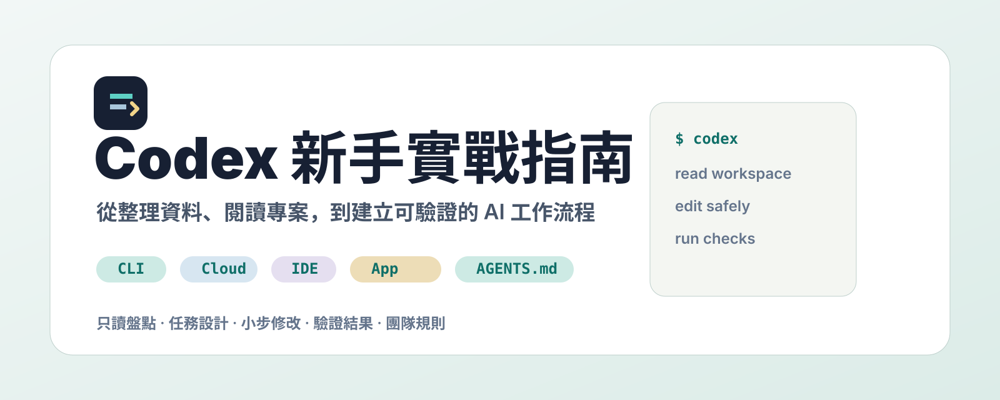

<p align="center">
  
</p>

<h3 align="center">給設計師、PM、內容工作者：用 Codex 整理資料、拆解需求、產出內容，完成低風險輕開發任務</h3>

<p align="center">
  <a href="https://codexguide.ai/"></a>
  
  <a href="./LICENSE"></a>
  <a href="./CONTRIBUTING.md"></a>
</p>

<p align="center">
  繁體中文
  ·
  <a href="./README_en.md">English</a>
  ·
  <a href="https://codexguide.ai/">線上閱讀</a>
  ·
  <a href="./docs/community/courses.md">課程報名</a>
  ·
  <a href="./docs/guide/00-overview.md">60 天路線</a>
  ·
  <a href="./docs/platform/index.md">使用入口</a>
  ·
  <a href="./docs/configuration/index.md">設定專題</a>
  ·
  <a href="./docs/practice/index.md">實踐方法</a>
  ·
  <a href="./docs/recipes/index.md">實戰案例</a>
  ·
  <a href="./docs/reference/index.md">官方資料</a>
  ·
  <a href="./docs/community/roadmap.md">共建路線圖</a>
</p>

> 從第一次上手，到把 Codex 放進真實工作流程；幫助不同背景的人用 Codex 完成開發、創作、研究、整理與團隊協作。
> 如果這個專案幫你節省了摸索時間，歡迎點亮 Star，讓更多人看到它。

## 線上網站

**線上閱讀地址是 [codexguide.ai](https://codexguide.ai/)。**

<p align="center">
  <a href="https://codexguide.ai/">
    
  </a>
</p>

GitHub README 適合快速瞭解專案，真正學習時更推薦開啟網站閱讀：網站裡有更完整的導航、搜尋、側邊欄目錄、截圖、設定速查圖、學習路線和實戰案例。每篇關鍵資料都會盡量標註最後核對日期，方便你判斷內容是否需要回到 OpenAI 官方資料重新確認。

如果你正在第一次接觸 Codex，可以先看 [第一次任務](https://codexguide.ai/guide/06-app-first-task)；如果想跟課實作，可以看 [課程報名](https://codexguide.ai/community/courses)。

## 專案願景

Codex 不只適合工程師。對設計師、PM、內容工作者來說，它更像一個可以讀資料夾、整理文件、拆解任務、產出草稿，也能處理低風險技術工作的 AI 工作台。

這份指南想做的不是命令速查表，而是一份面向真實任務的實踐知識庫。它關注三個問題：

- **怎麼開始**：第一次使用時，如何選一個低風險任務，而不是一開始就亂丟資料。
- **怎麼交付**：如何讓 Codex 讀資料、整理文件、改簡單頁面，並交出可檢查結果。
- **怎麼沉澱**：如何把一次成功任務變成提示詞、SOP、模板和團隊工作流。

這份教程主要以中文組織內容，重點放在設計、產品、內容、營運、研究與知識工作場景。工程相關內容仍會保留，但會放在進階區，不作為首頁主敘事。

## 適合誰

- **設計師**：整理需求、設計稿說明、頁面文案、交付檢查清單，並練習簡單前端修改。
- **PM**：整理 PRD、會議紀錄、競品資料、任務拆解、風險與待確認問題。
- **內容工作者**：整理素材、課程筆記、腳本、簡報大綱、文章草稿和內容 SOP。
- **想補輕開發能力的人**：不用變成工程師，但要會請 AI 改文案、調樣式、跑預覽、讀錯誤訊息。

## 課程報名

這份指南會搭配兩種課程，幫助設計師、PM、內容工作者把 Codex 放進真實工作。

- **直播線上課**：2 小時入門，完成一次自己的 AI 工作任務。早鳥 NT$990-1,980。
- **線下陪跑小班**：半日制，3-6 人，帶自己的資料或小專案現場做。NT$4,000-8,000/人。

報名與下一梯時間請看 [課程報名](./docs/community/courses.md)，或掃下方 LINE/IG 入口詢問。

## 你會在這裡看到什麼

| 內容 | 說明 |
| --- | --- |
| 入門路線 | 從第一個只讀不改任務開始，學會整理資料、設計工作邊界和驗證結果 |
| 課程報名 | 直播線上課與線下陪跑小班，適合帶自己的資料或小專案來做 |
| 設定專題 | 覆蓋 CLI 選項、`config.toml`、MCP、Skills、Subagents、安全審核 |
| 工作流方法 | 任務設計、驗證方式、非開發工作流、團隊 playbook |
| 實戰案例 | PPT、瀏覽器、Obsidian、Google Workspace、Figma、Notion、知識庫和輕開發案例 |
| 官方資料索引 | 彙總 OpenAI 官方資料、GitHub 倉庫和關鍵事實來源 |

## 推薦閱讀路徑

### 1. 第一次用 Codex 工作

先讀 [學習路線](./docs/guide/00-overview.md)，再完成 [桌面 App 下載與安裝](./docs/guide/01-app-installation.md)、[訂閱 Plus / Pro](./docs/guide/02-subscribe-plus.md)、[桌面 App 總覽](./docs/guide/03-app-overview.md)、[連線第三方 API](./docs/guide/05-third-party-api.md) 和 [第一個任務](./docs/guide/06-app-first-task.md)。

### 2. 想上課跟著做

看 [課程報名](./docs/community/courses.md)，選直播線上課或線下陪跑小班。上課前可以先準備一個資料夾、一份 PRD、一組截圖或一個想微調的小頁面。

### 3. 想補輕開發能力

從 [第一次讓 Codex 改程式碼](./docs/guide/13-cli-first-run.md)、[沙盒與審核](./docs/guide/16-sandbox-approvals.md) 開始，只挑低風險任務練習：改文案、調樣式、看 diff、跑預覽。

### 4. 想把 Codex 放進團隊

先看 [團隊 playbook](./docs/practice/team-playbook.md)，再補齊 [設定與擴充套件](./docs/configuration/index.md)、[安全管理](./docs/configuration/security-admin.md)、[排障手冊](./docs/guide/18-troubleshooting.md) 和 [實戰案例庫](./docs/recipes/index.md)。

## 快速入口

| 模組 | 適合解決什麼問題 |
| --- | --- |
| [學習路線](./docs/guide/00-overview.md) | 從入門、進階到團隊化的閱讀順序 |
| [入口地圖](./docs/platform/index.md) | CLI、桌面 App、Cloud/Web、IDE、ChatGPT 的選擇方法 |
| [桌面 App 下載與安裝](./docs/guide/01-app-installation.md) | Codex 桌面 App 下載、安裝、登入和基礎準備 |
| [手機端協同桌面任務](./docs/guide/04-mobile-control-desktop.md) | 用 ChatGPT 手機 App 中的 Codex 入口跟進桌面任務 |
| [連線第三方 API](./docs/guide/05-third-party-api.md) | 比較手動設定、Codex++、CCX 與 CC Switch 三種接入方式 |
| [第一次使用 Codex](./docs/guide/06-app-first-task.md) | 選擇低風險任務，並完成一次可驗證修改 |
| [CLI 安裝與登入](./docs/guide/12-cli-installation.md) | 在本地終端安裝 Codex CLI 並完成登入 |
| [第一次讓 Codex 改程式碼](./docs/guide/13-cli-first-run.md) | 用 CLI 進入真實倉庫，完成一次可檢查的程式碼任務 |
| [設定與擴充套件](./docs/configuration/index.md) | CLI 選項、config.toml、MCP、Skills、Subagents、安全審核 |
| [實踐方法](./docs/practice/index.md) | 任務設計、非開發工作流和團隊實踐 |
| [AGENTS.md](./docs/guide/15-agents-md.md) | 給 Codex 編寫專案級規則和協作邊界 |
| [沙盒與審核](./docs/guide/16-sandbox-approvals.md) | 檔案、命令、網路、憑據和生產資源的安全邊界 |
| [Cloud、IDE 與桌面 App](./docs/guide/17-cloud-ide-app.md) | 不同 Codex 使用入口的適用場景 |
| [實戰案例庫](./docs/recipes/index.md) | 可複製到真實專案的任務模板和覆盤結構 |
| [官方資料索引](./docs/reference/index.md) | OpenAI 官方資料、GitHub 倉庫和關鍵連結 |

## 內容框架

```text
Codex 新手實戰指南
├─ guide         # 從入門到團隊化的實踐指南
├─ platform      # CLI、App、Cloud、IDE、ChatGPT 入口地圖
├─ configuration # CLI 選項、config.toml、MCP、Skills、安全審核
├─ practice      # 任務設計、非開發工作流、團隊實踐
├─ recipes       # 可複用的真實工程案例
├─ reference     # 官方資料索引與事實來源
└─ community     # 共建路線圖與貢獻方向
```

當前已搭建：

- Codex 桌面 App 入門路徑。
- ChatGPT 手機 App 協同桌面任務。
- Codex CLI 和 IDE 使用路徑。
- Codex 多入口使用地圖和選擇建議。
- Codex 設定與擴充套件專題。
- 任務說明、提示詞模板和驗證方法。
- 非開發工作流與團隊實踐方法。
- `AGENTS.md` 專案規則模板。
- 沙盒、審核和安全邊界說明。
- Cloud、IDE、桌面 App、ChatGPT 使用場景對照。
- 內容生產、知識庫、瀏覽器、CI 修復等案例模板。
- 線上文件站、官方資料索引和社群貢獻模板。

## 本地預覽

環境要求：

- Node.js 18+ 或更新版本
- pnpm

```bash
pnpm install
pnpm dev
```

構建靜態站點：

```bash
pnpm build
```

預設開發服務會啟動 VuePress 文件站。線上版本目前發布到 [codexguide.ai](https://codexguide.ai/)。

## 設計原則

- **官方優先**：功能、價格、可用性、安全策略以 OpenAI 官方資料為準。
- **小白友好**：每個入門章節儘量說明“為什麼這樣做”和“什麼時候不要這樣做”。
- **真實任務導向**：減少抽象概念堆砌，多給可複製的任務流程、輸入、輸出和驗證方式。
- **安全邊界清晰**：涉及檔案寫入、命令執行、聯網、憑據、瀏覽器和電腦操控時明確風險。
- **可沉澱**：鼓勵把一次成功任務整理成 AGENTS.md、模板、案例、覆盤和團隊規範。

## 報名與交流

掃 LINE/IG 詢問直播線上課、線下陪跑小班與後續交流。訊息裡可以先說明你的角色、想處理的資料、目前卡住的任務。

<p align="center">
  
</p>

## 事實來源

本倉庫優先引用官方資料，並會在關鍵頁面標註“最後核對日期”。當前骨架參考：

- [OpenAI Codex 產品頁](https://openai.com/codex/)
- [Codex in ChatGPT Help Center](https://help.openai.com/en/articles/11369540-codex-in-chatgpt)
- [OpenAI Codex CLI Getting Started](https://help.openai.com/en/articles/11096431-openai-codex-cli-getting-started)
- [Codex cloud docs](https://platform.openai.com/docs/codex)
- [openai/codex GitHub repository](https://github.com/openai/codex)

## 參與貢獻

歡迎提交：

- 新手友好的教程改寫。
- 可復現的真實案例。
- 常見錯誤和解決方案。
- 團隊實踐、模板和工作流。
- 官方文件變更同步。

請先閱讀 [貢獻指南](./CONTRIBUTING.md)。如果你還不確定怎麼貢獻，可以從 [Roadmap](./docs/community/roadmap.md) 或 `good first issue` 開始。

## 開源協議

本專案採用 [MIT License](./LICENSE) 開源。你可以在保留許可宣告的前提下自由使用、修改、分發與二次開發。

## 宣告

本專案是社群維護的 Codex 實踐知識庫，並非 OpenAI 官方專案。涉及功能、計劃、價格、可用性和安全策略等時間敏感資訊時，請以 OpenAI 官方資料為準。
