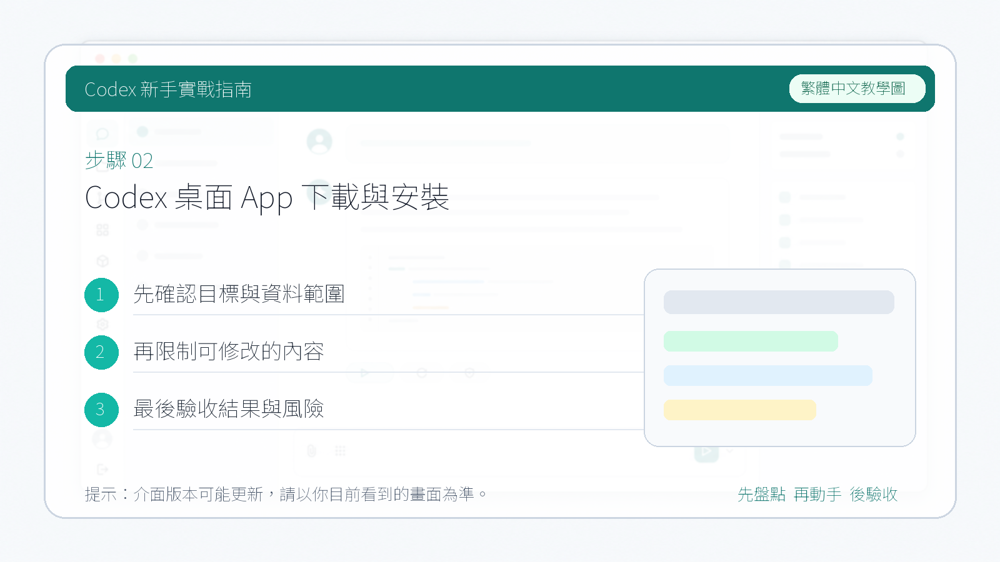

# Codex 桌面 App 下載與安裝

::: tip 最後核對
官方資料最後核對日期：2026-05-27。下載地址與安裝方式以 [OpenAI Codex 產品頁](https://openai.com/codex/) 和 [chatgpt.com/codex/cloud](https://chatgpt.com/codex/cloud) 為準，不同地區和帳號方案下可用功能可能有所差異。
:::

本教程裡的 **Codex 桌面 App** 指電腦端客戶端，不是手機 App。它由 OpenAI 官方釋出，支援 macOS 和 Windows，安裝後可以在本地管理專案、發起任務、使用 Skills 和 Automations。

## 下載

開啟 [chatgpt.com/codex/cloud](https://chatgpt.com/codex/cloud)，頁面中央會顯示對應系統的下載按鈕。

**macOS：**

點選「Download for macOS」下載 `.dmg` 安裝包。

**Windows：**

Windows 使用者點選對應的下載按鈕，下載完成後執行安裝程式，按提示完成安裝。

## macOS 安裝步驟

1. 開啟下載好的 `.dmg` 檔案
2. 將 Codex 圖示拖入「Applications（應用程式）」資料夾
3. 首次啟動時，macOS 可能提示「無法驗證開發者」，進入「系統設定 → 隱私與安全性」，點選「仍要開啟」

## 登入

安裝完成後開啟 App，使用 ChatGPT / OpenAI 帳號登入。

::: warning 注意方案限制
Codex 桌面 App 的完整功能（多 agent 並行、Skills、Automations 等）需要 **Plus 及以上方案**。免費帳號登入後部分功能會受限或無法使用。如需升級，參考下一章：[訂閱 ChatGPT Plus](./02-subscribe-plus.md)。
:::

::: tip
如果登入失敗，可以考慮切換代理節點或者切換代理，可以選擇非美國節點。
:::

## 安裝後驗證

登入成功後，左側欄應顯示「Projects」和「Chats」兩個入口，頂部顯示當前帳號資訊。如果介面正常載入，說明安裝成功。

下一步：[訂閱 ChatGPT Plus / Pro](./02-subscribe-plus.md)
