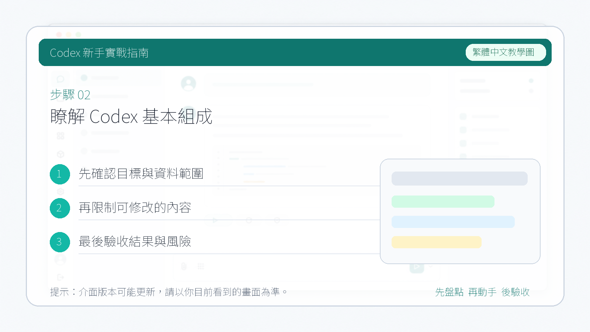
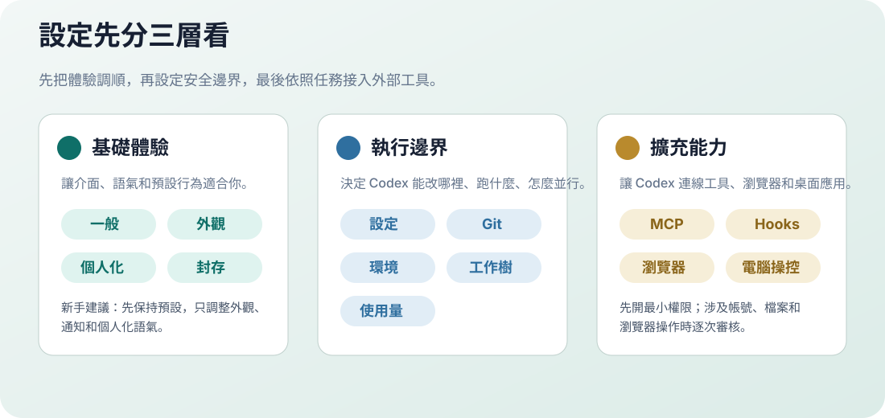

# 瞭解 Codex 基本組成

::: tip 最後核對
官方資料最後核對日期：2026-05-27。本章參考 [Codex App docs](https://developers.openai.com/codex/app)、[Settings](https://developers.openai.com/codex/app/settings)、[Agent approvals and security](https://developers.openai.com/codex/agent-approvals-security) 等官方資料。介面說明以當前 Codex 桌面 App 實際版本為準，不同系統、地區、客戶端版本和帳號方案下顯示可能略有差異。
:::

## 認識對話和專案

開啟 Codex 桌面 App，左側欄包含兩個主要入口：**Chat（對話）** 和 **Project（專案）**。

**Chat 對話**

與 ChatGPT 網頁端對話體驗基本一致，適合處理日常的、一次性的問答和簡單任務。每個對話相互獨立，不共享工作目錄。

**Project 專案**

適合需要操作本地檔案的任務，例如生成程式碼、編寫文件、製作 PPT、完成報告。在專案裡建立的所有對話都共享同一個本地工作目錄，方便統一管理多個子任務。

在專案裡下達指令後，Codex 的修改會直接應用到你本地資料夾中的檔案。

## 對話方塊功能說明

Codex 桌面 App 的對話方塊與 ChatGPT 網頁端類似，但額外提供了以下功能：

1. **新增上下文**：可以附加檔案、截圖或其他參考內容
2. **切換模型**：在不同模型之間切換
3. **控制權限**：設定 Codex 在當前任務中的操作權限
4. **選擇工作目錄**：指定 Codex 在哪個本地資料夾下執行任務

## 設定面板

點選左下角頭像或設定圖示可以開啟設定面板。

上圖左側就是 Codex 桌面 App 的設定選單。不要把它當成一次性必須填完的表單：新手只需要確認「常規」和「權限」能支撐第一個任務，其他設定等真實場景出現後再逐步開啟。

## 新手先按這四步檢查

1. **先選工作模式**：做程式碼、網站、指令碼、倉庫任務時選「適用於程式設計」；寫文案、整理資料、做非程式碼任務時可以選「適用於日常工作」。
2. **先別急著開最大權限**：剛開始建議讓 Codex 只在當前工作區內讀寫檔案，遇到聯網、系統檔案、危險命令時再單獨審核。
3. **先設定工作目錄**：第一個任務儘量使用一個空資料夾或測試專案，不要直接把重要專案交給新手階段的 Codex。
4. **先觀察使用情況**：如果任務經常中斷、額度告急或模型響應變慢，再回到「使用情況」和方案頁面確認限制。

::: warning 截圖不是推薦設定
截圖中的開關只是介面示例，不代表所有讀者都應該照著開啟。尤其是「完全訪問權限」、瀏覽器控制、電腦操控、鉤子和 MCP 伺服器，第一次使用時都應該按任務逐步開啟。
:::

## 設定逐項說明

  <section class="setting-card">
    <strong>常規</strong>
    
這裡決定 Codex 預設以什麼方式回答和執行任務。最重要的是「工作模式」和「權限」。如果你要跟著本教程做網頁、指令碼、程式碼修改，優先選「適用於程式設計」；它會保留更多技術細節、命令輸出和變更說明。如果只是寫提綱、整理資料或改文案，可以切到「適用於日常工作」，回覆會更輕量。

    
「預設權限」通常表示 Codex 可以在當前工作區裡讀取和編輯檔案；「自動稽核」會讓它對額外權限請求做部分自動判斷；「完全訪問權限」會顯著放大能力和風險。小白階段不建議長期開啟完全訪問權限，等你能看懂它要執行的命令後，再按任務臨時使用。

    <em>新手推薦：程式設計模式 + 最小可用權限</em>
  </section>

  <section class="setting-card">
    <strong>外觀</strong>
    
外觀隻影響顯示體驗，比如淺色 / 深色模式、字型觀感、介面密度或視窗呈現方式。它不會改變 Codex 能不能讀檔案、改程式碼或聯網。

    
如果你經常截圖寫教程，建議統一使用淺色模式和較大的視窗寬度；如果長時間閱讀終端輸出，可以使用深色模式減少視覺疲勞。教程截圖和你的實際介面顏色不同，不影響功能位置。

    <em>新手推薦：按閱讀習慣選擇</em>
  </section>

  <section class="setting-card">
    <strong>設定</strong>
    
設定頁對應官方文件裡的 agent configuration，通常用於管理模型、推理強度、沙盒、審核策略、網路訪問和本地設定檔案。桌面 App 會把常用項做成可點選的介面，高階使用者也可以進一步檢視 <a href="https://developers.openai.com/codex/config-basic">config.toml 基礎設定</a> 與高階設定。

    
初學時不要一上來追求“全自動”。如果你不知道某個選項會帶來什麼後果，優先保持預設；等你遇到“總是需要審核同一個安全命令”“某個專案需要固定模型”“團隊要統一規則”時，再回來調整。

    <em>新手推薦：預設即可</em>
  </section>

  <section class="setting-card">
    <strong>個性化</strong>
    
個性化用於調整 Codex 的溝通風格和預設偏好，例如更詳細、更簡潔、更偏教學式，或在任務中遵守你的長期習慣。它適合放“你希望 Codex 怎麼跟你協作”的規則，不適合放專案級命令。

    
專案級規則應該寫進 <a href="./15-agents-md.html">AGENTS.md</a>，例如測試命令、程式碼風格、禁止改動目錄。個人偏好可以寫“回答先給結論”“中文解釋”“提交前列出驗證命令”。這樣個人習慣和專案規則不會混在一起。

    <em>新手推薦：只寫 3 條以內</em>
  </section>

  <section class="setting-card">
    <strong>MCP 伺服器</strong>
    
MCP 伺服器讓 Codex 連線外部工具，例如瀏覽器、設計工具、知識庫、資料庫、Google Workspace、Notion、Slack 或自定義系統。官方文件把 MCP 視為擴充套件 Codex 能力的重要方式，但每接入一個服務，也意味著 Codex 能看到或操作更多上下文。

    
小白不要一次性接很多 MCP。先從一個低風險工具開始，比如只讀知識庫或瀏覽器測試；需要 API Key 時儘量使用環境變數或系統憑據管理，不要把金鑰直接寫進教程、截圖或對話裡。

    <em>新手推薦：一個場景只開一個 MCP</em>
  </section>

  <section class="setting-card">
    <strong>鉤子</strong>
    
鉤子是讓 Codex 在特定時機自動觸發指令碼或命令的機制，例如任務開始前準備環境、任務結束後執行格式化、測試或檢查。它很適合團隊標準化，但也最容易因為命令寫錯而帶來副作用。

    
第一次使用時可以先不設定鉤子。等你明確知道“每次修改後都必須跑 pnpm lint”或“每次提交前都要生成報告”時，再把這些固定動作寫進去。鉤子裡的命令要短、可重複、失敗資訊清晰，不要放刪除、釋出、上傳金鑰這類高風險動作。

    <em>新手推薦：先空著</em>
  </section>

  <section class="setting-card">
    <strong>Git</strong>
    
Git 設定用於管理 Codex 如何理解當前倉庫、分支、diff、提交和遠端協作。對於真實專案，Git 是你回滾和審查 Codex 修改的安全網。

    
新手最好養成兩個習慣：讓 Codex 開始前先看 <code>git status</code>，結束後列出改動檔案和驗證結果。不要讓 Codex 在你沒看 diff 的情況下直接 push 或改主分支；團隊專案可以統一使用 <code>codex/</code> 這類分支字首。

    <em>新手推薦：每次任務前後看 git status</em>
  </section>

  <section class="setting-card">
    <strong>環境</strong>
    
環境設定通常用於準備專案執行所需的依賴、命令、環境變數和本地初始化步驟。官方 App 文件裡的 Local environments 關注的是讓 Codex 在可復現的環境裡工作，而不是每次都重新猜專案怎麼啟動。

    
你可以把常用準備步驟寫成指令碼，例如安裝依賴、複製示例設定、啟動服務。不要把真實生產金鑰寫進指令碼；需要金鑰時使用本機環境變數、團隊金鑰管理或明確的人工審核流程。

    <em>新手推薦：先記錄啟動命令</em>
  </section>

  <section class="setting-card">
    <strong>工作樹</strong>
    
工作樹對應 Git worktree。它允許 Codex 在同一個倉庫旁邊開出獨立工作區，適合並行做多個任務，或讓不同 agent 同時處理不同分支而互不覆蓋。

    
如果你還不熟悉 Git 分支，先不要急著使用工作樹。等你需要“同時讓 Codex 修兩個 bug”“一個任務跑測試，另一個任務改文件”時，再開啟。使用後要定期清理不再需要的工作樹，避免磁碟裡留下很多過期副本。

    <em>新手推薦：會用分支後再用</em>
  </section>

  <section class="setting-card">
    <strong>瀏覽器</strong>
    
瀏覽器設定讓 Codex 可以開啟網頁、點選、輸入、截圖和檢查頁面狀態。它適合前端驗收、登入態頁面檢查、表單流程測試和資料查閱。官方 App 文件也把 In-app browser 作為桌面 App 的重要能力之一。

    
瀏覽器能力會接觸帳號、網頁內容和可能的表單提交。不要讓 Codex 隨便在第三方網站提交個人資訊、付款、刪除內容或改權限。做前端測試時，優先用本地 <code>localhost</code> 頁面；做線上頁面時，先明確允許它看什麼、不能點什麼。

    <em>新手推薦：先用於本地預覽</em>
  </section>

  <section class="setting-card">
    <strong>電腦操控</strong>
    
電腦操控讓 Codex 像使用者一樣讀取螢幕、點選應用和輸入內容。它適合沒有 API 或 MCP 的桌面軟體，例如設計工具、辦公軟體、系統彈窗或只能透過 UI 操作的流程。

    
這類能力風險高於普通檔案編輯。首次使用時只給明確、低風險、可撤銷的動作，例如“開啟這個視窗並截圖說明”。不要讓它替你最終確認付款、改密碼、刪除雲檔案、傳送訊息或提交重要表單。

    <em>新手推薦：只做觀察和截圖</em>
  </section>

  <section class="setting-card">
    <strong>已歸檔對話</strong>
    
歸檔對話用於收起不再活躍的執行緒，讓側邊欄保持乾淨。歸檔不是刪除，通常還可以找回歷史上下文、結論和檔案修改記錄。

    
如果一個任務已經完成、驗證透過、總結也寫好了，就可以歸檔。還沒合併、還在等審核、或者你可能繼續追問的任務先不要歸檔，避免之後找上下文費勁。

    <em>新手推薦：完成後再歸檔</em>
  </section>

  <section class="setting-card">
    <strong>使用情況</strong>
    
使用情況用於檢視額度、用量或方案相關狀態。Codex 的可用功能、額度和併發能力會隨帳號計劃變化，具體以 ChatGPT / OpenAI 當前方案說明為準。

    
如果 Codex 變慢、任務被限流、無法啟動新任務，先看這裡，再去核對 <a href="./02-subscribe-plus.html">訂閱 Plus / Pro</a> 章節。團隊帳號還要確認管理員是否限制了某些能力。

    <em>新手推薦：遇到限制時先看這裡</em>
  </section>

## 什麼時候需要改設定

| 你遇到的情況 | 優先檢查 |
| --- | --- |
| Codex 回答太技術或太囉嗦 | 常規、個性化 |
| 每次都問同一個安全命令 | 常規權限、設定、專案 `AGENTS.md` |
| 需要連線 Figma、Notion、Google Workspace、Slack 或資料庫 | MCP 伺服器 |
| 想讓任務結束後自動跑測試 | 鉤子、環境 |
| 想同時跑多個倉庫任務 | Git、工作樹 |
| 需要開啟網頁檢查 UI | 瀏覽器 |
| 需要操作桌面軟體 | 電腦操控 |
| 找不到舊任務 | 已歸檔對話 |
| 無法繼續啟動任務或額度不足 | 使用情況、訂閱方案 |

::: tip 官方資料怎麼配合看
設定頁裡的名稱會隨著客戶端迭代變化。遇到和教程截圖不一致時，先看 OpenAI 官方的 [Codex App docs](https://developers.openai.com/codex/app)，再回到本教程查中文場景解釋。
:::

下一步：[用手機端 Codex 跟進桌面任務](./04-mobile-control-desktop.md)
