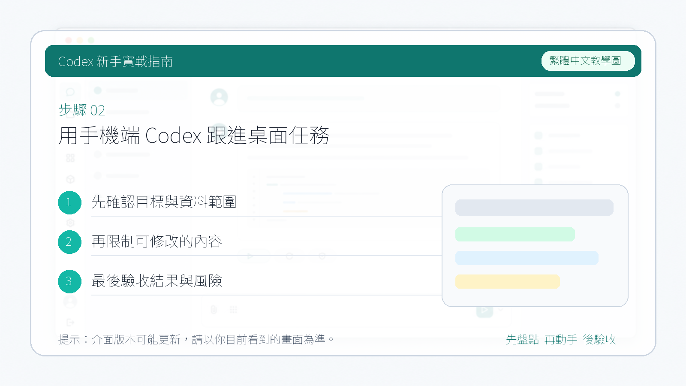

# 用手機端 Codex 跟進桌面任務

::: tip 最後核對
官方資料最後核對日期：2026-05-27。本文參考 OpenAI 官方文章 [Work with Codex from anywhere](https://openai.com/index/work-with-codex-from-anywhere/)。具體入口、可用地區、系統支援和介面名稱會隨客戶端更新變化，請以當前 ChatGPT 手機 App 和 Codex 桌面 App 為準。
:::

這裡說的“手機端 Codex”，更準確地說，是 **ChatGPT 手機 App 裡的 Codex 入口**。它不是單獨的手機 Codex App，也不是把手機變成遠端桌面滑鼠鍵盤。

你可以把它理解成：桌面 App、遠端開發機或其他已授權環境里正在執行 Codex，手機端負責連線這些環境，讓你在離開電腦時繼續檢視、回覆、審核和調整任務。

你需要更新你的 ChatGPT APP 到最新版本，然後選擇連線你電腦裡面的 Codex。

連線桌面 Codex APP：

在 ChatGPT 中開啟 Codex，就可以直接使用了。

## 它能做什麼

手機端連線到正在執行 Codex 的機器後，可以繼續處理這些事情：

- 檢視正在進行的執行緒和任務狀態。
- 閱讀 Codex 的階段性輸出、終端輸出、截圖、diff 和測試結果。
- 回覆 Codex 的澄清問題。
- 審核命令、網路訪問或其他需要人工確認的操作。
- 改變任務方向、切換模型或補充新的上下文。
- 新建任務，讓 Codex 從已連線的開發環境裡開始工作。

真正執行任務的地方仍然是桌面 App 或遠端環境。你的檔案、依賴、憑據、權限和本地設定不會因為手機端接入而搬到手機上。

## 使用前提

使用前先確認這些條件：

- 手機上安裝並更新 ChatGPT App。
- 電腦上安裝並更新 Codex 桌面 App。
- 手機和電腦登入同一個 ChatGPT / OpenAI 帳號，且處在支援 Codex 的地區和方案範圍內。
- 桌面 App 已經連線到對應專案，或 Codex 正在某臺已授權機器、devbox、遠端環境中執行。
- 如果任務會寫檔案、跑命令、訪問網路，仍然需要理解並確認對應權限。

::: info 平台支援
OpenAI 官方文章說明，Codex 手機端能力正在 iOS 和 Android 的 ChatGPT App 中預覽推出。連線 macOS 上的 Codex App 可用；連線 Windows 上的 Codex App 支援仍以官方當前說明為準。
:::

## 推薦使用場景

手機端最適合處理“離開電腦但不想讓任務停住”的時刻：

- 通勤路上檢視長任務進展。
- Codex 需要你選擇方案時，快速給出方向。
- 任務卡在權限審核時，從手機上批准或拒絕。
- 會議前讓 Codex 彙總最新程式碼、issue、文件或客戶背景。
- 突然想到一個改動點，先發給 Codex 開始探索，回到電腦後再細看 diff。

## 不適合怎麼用

手機端不適合替代完整的本地審查流程。下面這些事情最好回到電腦上做：

- 大範圍程式碼合併前的最終 review。
- 涉及生產環境、金鑰、帳單、釋出部署的高風險操作。
- 需要長時間閱讀大量 diff 的任務。
- 需要你手動操作 IDE、偵錯程式或本地 GUI 的任務。

如果你在手機上審核命令，建議只批准自己能看懂的操作。遇到刪除、覆蓋、部署、傳輸敏感資料等動作，先停下來，回到電腦上確認。

## 一個典型流程

1. 在電腦上開啟 Codex 桌面 App，並進入對應專案。
2. 讓 Codex 開始一個需要較長時間的任務，例如排查失敗測試或整理文件。
3. 離開電腦後，在 ChatGPT 手機 App 中進入 Codex。
4. 開啟同一個正在執行的任務執行緒。
5. 檢視 Codex 的輸出、截圖、終端日誌、測試結果或 diff。
6. 如果 Codex 需要確認，直接在手機上回復、審核或調整方向。
7. 回到電腦後，再做完整 diff review、執行驗證命令和提交。

## 和 Codex Cloud 的區別

| 對比項 | 手機端連線桌面 App | Codex Cloud |
| --- | --- | --- |
| 執行位置 | 你的電腦、devbox 或遠端環境 | OpenAI / ChatGPT 連線的雲端任務環境 |
| 檔案與憑據 | 留在原機器上 | 依賴雲端連線的倉庫與授權 |
| 適合任務 | 跟進本地長任務、審核、檢視結果 | 不依賴本地電腦的倉庫任務 |
| 是否能離開電腦 | 可以，但原執行環境要可連線 | 可以 |

一句話：**手機端 Codex 更像“隨身工作台”，Codex Cloud 更像“雲端執行環境”。**

下一步：[連線第三方 API](./05-third-party-api.md)
