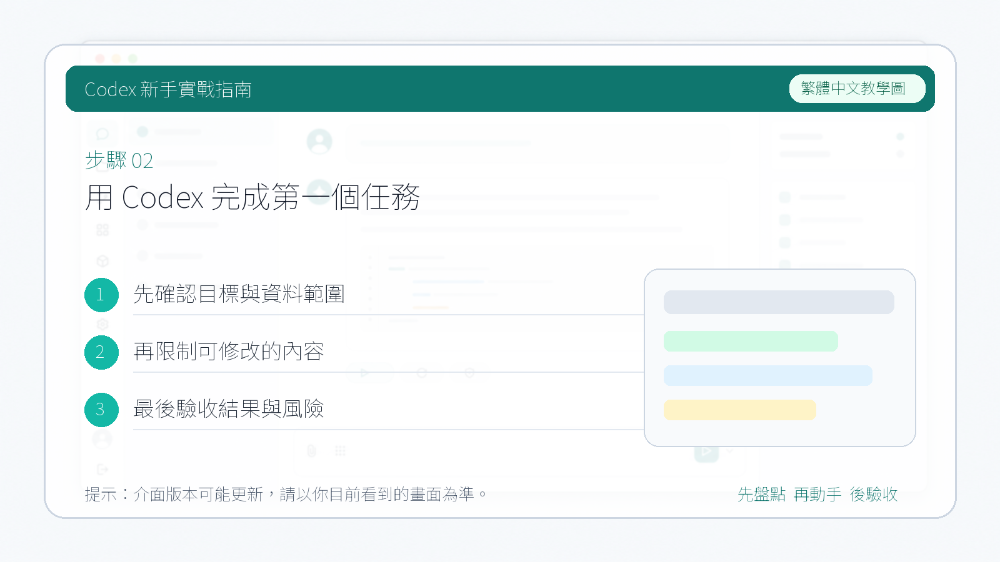

# 用 Codex 完成第一個任務

::: tip 最後核對
官方資料最後核對日期：2026-05-27。本章以開發一個簡單網頁為例，演示從建立工作目錄到任務迭代的完整操作流程。
:::

本章以"用 Codex 桌面 App 開發一個關於 AI 發展歷史的簡單網頁"為例，走完一次完整的任務閉環，幫助你快速上手 Codex 桌面 App 的基本用法。

## 第一步：建立本地工作資料夾

在本地新建一個空資料夾，作為 Codex 的工作目錄。Codex 生成的所有檔案都會儲存在這裡。

::: warning
資料夾路徑中儘量不要包含中文，避免部分工具出現相容性問題。
:::

## 第二步：選擇對話還是專案

開啟 Codex 桌面 App 後，你需要選擇用"對話"還是"專案"來開始任務。

- **對話**：適合一次性任務，操作簡單，但多個對話之間不共享工作目錄。
- **專案**：支援在同一工作目錄下建立多個對話，每個對話處理不同的子任務，管理更方便。

如果你不確定選哪個，**優先選擇專案**——後續擴充套件任務時更靈活，工作目錄也只需要設定一次。

## 第三步：新增工作目錄

選擇專案後，點選"使用現有資料夾"，選中剛才建立的資料夾。

選擇完成後，對話方塊左下角會顯示當前工作目錄的路徑，確認路徑正確即可。

## 第四步：輸入任務描述，開始執行

在對話方塊中輸入你的需求，點選傳送，Codex 就會開始執行任務。

任務完成後，Codex 會在對話中展示結果，同時將生成的檔案寫入工作目錄。

如果生成的是網頁檔案，可以直接點選 Codex 彈出的"開啟"按鈕，在 App 內建瀏覽器中預覽效果，無需手動開啟資料夾。

## 第五步：逐步迭代

對結果不滿意時，直接在當前對話方塊中繼續描述修改需求，Codex 會在已有基礎上進行調整。

隨著對話輪次增加，上下文視窗會逐漸被填滿。點選對話方塊右下角的小圓圈圖示，可以檢視當前上下文使用情況。

::: info 什麼是上下文視窗？
每次對話都有容量上限，每一輪問答都會佔用一定空間。當上下文接近滿載時，建議在專案中新建一個對話繼續處理後續任務——新對話仍然共享同一工作目錄，不需要重新設定。
:::

如果使用的是"對話"模式而非專案，新建對話時需要重新指定工作目錄，兩個對話之間也是相互隔離的，不方便統一管理。這也是推薦使用專案的主要原因之一。
