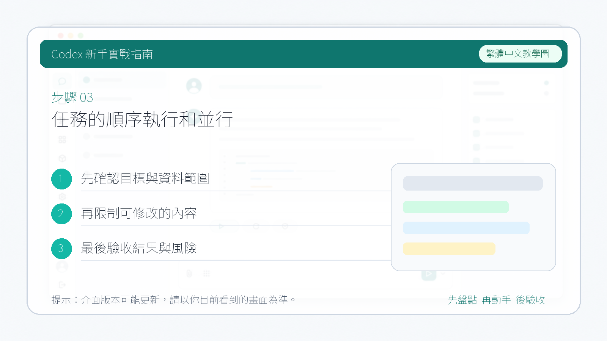

# 任務的順序執行和並行

本小節來介紹一下，在使用 codex 的過程中，如何進行任務順序執行的管理以及任務的並行操作。

我們使用codex開發obsidian新手教程網站作為示例：來說明任務的順序執行管理和並行操作

# 1.順序執行

選擇本地專案/建立新的專案，該專案實際上就對應我們本地的一個資料夾，它儲存在我們的本地。

然後點選建立新的對話。

我們向 CodeX 傳送任務，讓他幫我們設計一個網站，這個時候他就會開始執行。

在這個任務沒有執行的過程中，如果我們去給他下達新的命令，就只能等待。顯示的是下面這種情況：

這種相當於當前他正在執行一個任務，我們給他的另外兩個命令就需要排隊，必須等前面的任務執行完成之後才能執行。

但是如果我們想修改一下要求，比如想讓他明確這個網站的背景風格為“手繪風格”，如果等他設計完成之後再去修改就會比較麻煩。我希望他在正在設計的時候就知道我的風格要求。

這時候，我們可以點選**引導**選項。這樣操作後，他就會執行一個“插隊”的操作：

1. 原本的任務順序：
   (a) 執行網站設計
   (b) 介紹技術選型
   (c) 執行手繪風格要求（原定第三個任務）

2. 插隊後的效果：
   我們想讓“手繪風格”在設計過程中就發揮作用，透過點選引導提示，這個任務就會直接插隊到當前正在執行的任務當中。

這實際上就是透過這樣一個過程，演示如何對順序執行的任務進行管理以及相關的插隊操作。

# 2.如何並行

實際上就是一個專案（Project）裡面，我們同時去執行多個任務。

這個時候，我們只需要在左側邊欄點選“新建對話”就可以了。這樣的話，它的幾個任務就會並行執行，互不干擾。
