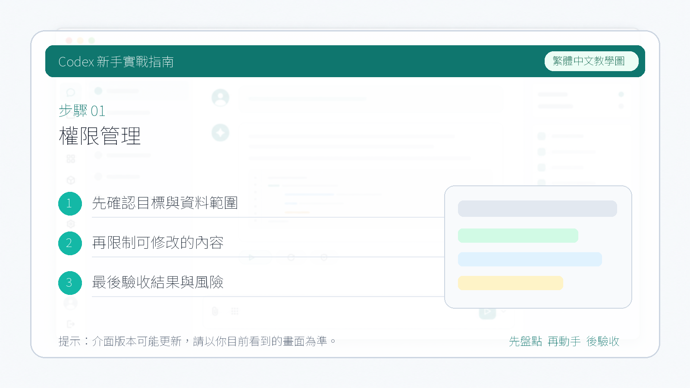

# 權限管理

這一節介紹 Codex 中常見的權限與審核模式。不同入口的介面文案可能會略有差異，但核心問題始終是一樣的：Codex 能不能自動改檔案、能不能自動執行命令、哪些操作需要你確認。

::: tip 最後核對
官方資料最後核對日期：2026-05-27。本文參考 [OpenAI Codex CLI – Getting Started](https://help.openai.com/en/articles/11096431-openai-codex-cli-getting-started) 與 [Using Codex with your ChatGPT plan](https://help.openai.com/en/articles/11369540-using-codex-with-your-chatgpt-plan)。具體名稱、入口和可用選項請以你當前使用的客戶端介面為準。
:::

## 三種常見模式

1. `Suggest`
   這是最保守的模式。Codex 可以讀取檔案並提出修改建議，但真正改檔案或執行命令前，通常仍需要你確認。它適合初次瞭解陌生倉庫、做程式碼審查、或者你希望全程掌控關鍵操作的時候使用。

2. `Auto Edit`
   這個模式通常允許 Codex 自動寫檔案，但在執行 shell 命令時仍會保留人工確認。它適合你已經比較瞭解專案結構，想讓 Codex 快速完成重構、批次改文件或區域性實現，但又不想完全放開命令執行權限的場景。

3. `Full Auto`
   這是自主性最高的模式。Codex 會在受限環境中自動讀取、寫入並執行命令，適合較長的連續任務，比如修復構建、跑一輪驗證或完成一個邊界明確的小功能。因為風險更高，最好只在版本可回退、任務範圍清晰、並且你理解當前沙盒邊界時使用。

## 怎麼選更穩妥

- 第一次進入新專案，優先從 `Suggest` 開始。
- 需要批次修改文件、樣式或測試時，可以考慮 `Auto Edit`。
- 只有在任務邊界明確、倉庫可回滾、並且你接受它連續執行命令時，再考慮 `Full Auto`。

## 使用時的提醒

- 不同客戶端可能不會把權限模式寫成完全一樣的中文名，建議優先認官方英文模式名。
- 即使使用更自動化的模式，也要保留對高風險操作的複核，比如安裝依賴、刪除檔案、訪問網路、推送程式碼或處理敏感資訊。
- 如果你不確定當前模式會不會執行某個動作，先讓 Codex 說明它準備執行哪些命令、會改哪些檔案，再決定是否繼續。
