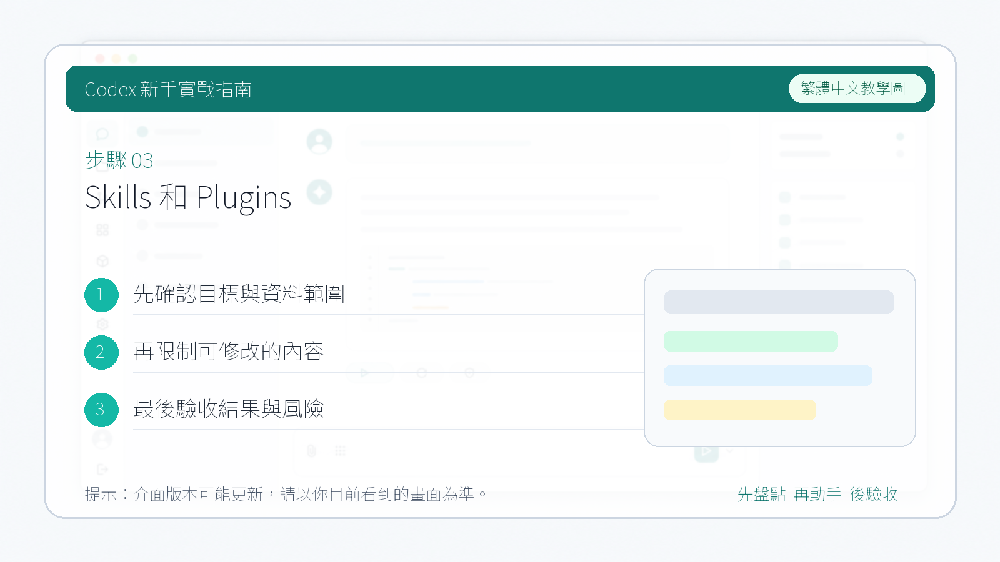

# Skills 和 Plugins

這一節介紹 Codex 裡的 `Skills` 和 `Plugins`。不同版本的 App 或工作區裡，入口位置和展示方式可能會調整，但核心區別相對穩定：`Skill` 更像可複用的工作流程說明，`Plugin` 更像把一組能力打包後分發和安裝的方式。

::: tip 最後核對
官方資料最後核對日期：2026-05-27。本文參考 [Codex Skills](https://developers.openai.com/codex/skills) 與 [Using Codex with your ChatGPT plan](https://help.openai.com/en/articles/11369540-using-codex-with-your-chatgpt-plan)。如果你的介面與本文截圖不完全一致，請優先以當前客戶端和工作區可用功能為準。
:::

如果你在 App 中看到了和技能、外掛相關的入口，可以結合下面的概念來理解它們：

## Skill 是什麼

`Skill` 可以理解為一份讓 Codex 穩定執行重複任務的操作手冊。當某個工作流已經很固定，例如“審查 PR”“整理文件”“補案例索引”，就可以把它沉澱成一個 Skill，減少每次重複描述的成本。

一個 Skill 通常會包含：

1. 一個 `SKILL.md` 檔案
   這裡會寫清觸發場景、執行步驟、輸出格式和注意事項。
2. 必要時配套指令碼、模板或參考檔案
   用來幫助 Codex 更穩定地完成任務。

常見使用方式是：

- 先準備或安裝可用的 Skill。
- 在發起任務時明確說明你希望使用哪個 Skill。
- 讓 Codex 按這個 Skill 的流程執行，再根據結果繼續追問或迭代。

有些工作區會提供更直接的安裝或啟用方式；也有一些場景裡，需要先把 Skill 放到約定目錄，或者透過現有外掛能力來分發。穩妥起見，不建議把“給一個 GitHub 連結就一定能自動安裝”寫成固定結論，更好的表述是：可以把 Skill 來源交給 Codex 協助識別和安裝，但具體流程會受客戶端能力和工作區設定影響。

## Plugin 是什麼

`Plugin` 更像一種打包和分發機制，用來把可複用工作流、應用整合、MCP 服務設定等能力組合起來，方便在專案或團隊中統一安裝和使用。

簡單理解：

- `Skill` 關注“這件事應該怎麼做”。
- `Plugin` 關注“把哪些能力打包起來，方便安裝和複用”。

所以 Skill 往往是具體流程本身，而 Plugin 更像承載這些流程和整合能力的安裝單元。

## 怎麼理解它們的關係

你可以把兩者想成：

- Skill 是“工作說明書”
- Plugin 是“裝著說明書、工具和連線設定的工具箱”

有些外掛裡會包含一個或多個 Skills，也可能附帶應用整合或 MCP 設定。這樣團隊在遷移環境時，不用手動一個個設定。

## 使用時的提醒

- 外掛和技能的具體入口會隨版本變化，不要把某個截圖裡的按鈕位置當成永遠不變。
- 如果外掛涉及外部系統、瀏覽器、郵箱、知識庫或專案管理工具，先確認它是隻讀還是可寫。
- 涉及安裝、寫回外部系統或共享給團隊時，最好保留人工複核。

