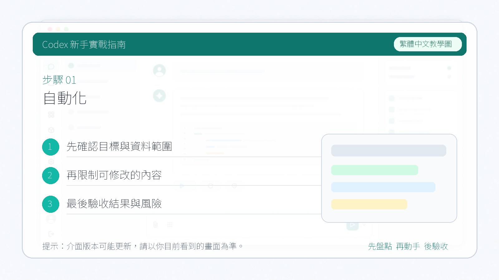

# 自動化

這一節介紹 Codex 中的 `Automation`。如果說 Skill 更關注“怎麼做”，那麼 Automation 更關注“什麼時候自動去做”。

::: tip 最後核對
官方資料最後核對日期：2026-05-27。本文參考 [Using Codex with your ChatGPT plan](https://help.openai.com/en/articles/11369540-using-codex-with-your-chatgpt-plan) 與 [Codex use cases](https://developers.openai.com/codex/use-cases/)。不同客戶端、工作區方案和權限設定下，自動化入口和可選項可能會有所不同。
:::

當一個工作流已經足夠穩定、而且會重複發生時，就可以考慮把它交給 Automation，在後臺按計劃觸發，而不是每次都手動發起。

適合自動化的任務包括：

- 定期檢查文件死鏈
- 每週整理一次 issue 或 PR 摘要
- 每天彙總 failing CI
- 在固定時間提醒補覆盤或更新文件

## 可以怎麼理解自動化

一個自動化任務通常至少會包含三部分：

1. 目標物件
   它對應哪個專案、倉庫或執行緒。
2. 觸發時機
   比如固定時間、固定間隔，或者稍後回到當前任務繼續跟進。
3. 執行內容
   也就是讓 Codex 到時具體去完成什麼。

## 常見使用流程

在支援 Automations 的介面裡，你通常會經歷類似下面的流程：

1. 選擇對應的專案、倉庫或當前執行緒。
2. 設定執行時間或執行週期。
3. 寫清楚自動化任務本身的目標、輸出格式和邊界。
4. 儲存後觀察第一次執行結果，再決定是否長期保留。

這裡最容易被忽略的一點是：自動化 prompt 要儘量寫成”自包含”的任務說明。不要預設它會記得你之前說過什麼，最好把檢查範圍、輸出格式和驗證要求寫完整。

❌ 不夠自包含的寫法：

```text
請檢查一下文件裡的連結有沒有問題。
```

✅ 推薦的寫法：

```text
請檢查 docs/ 目錄下所有 .md 檔案中的外部連結是否有效。

檢查範圍：僅檢查以 http:// 或 https:// 開頭的連結，忽略錨點和相對路徑。
輸出格式：按”檔案路徑 | 行號 | 連結 | 狀態”列出失效連結；全部正常時輸出”全部連結正常”。
驗證方式：對每個連結發起 HEAD 請求，超時 5 秒視為失效。
限制：不修改任何檔案，不建立新檔案。
```

兩者的區別在於：第一種每次觸發時 Codex 都要靠猜測來填補缺失的細節，結果容易不穩定；第二種把邊界、格式、驗證方式都寫明白了，無論在哪次執行、哪個上下文裡，行為都是一致可預期的。

## 使用時的提醒

- 不同工作區裡的自動化能力可能並不完全一樣，有些支援專案級任務，有些更偏向提醒和跟進。
- 第一次設定時，建議先從低風險、只讀型任務開始。
- 如果自動化會寫檔案、訪問外部系統或觸發通知，最好先確認權限邊界和人工複核方式。


