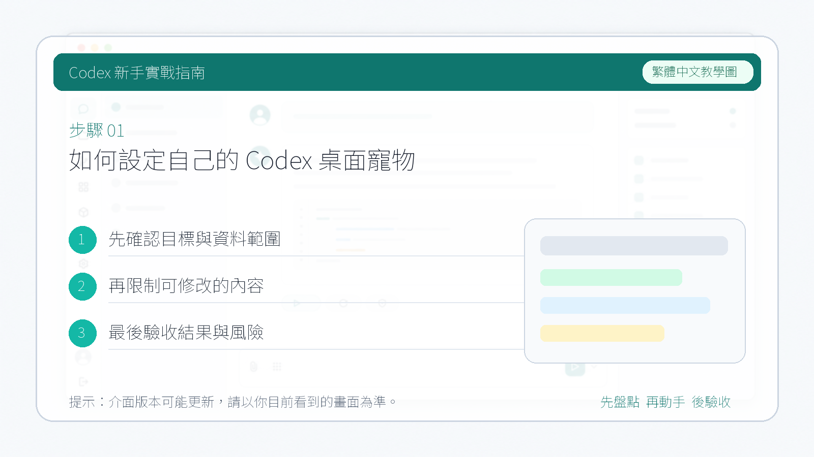

# 如何設定自己的 Codex 桌面寵物

前段時間，Codex 新增了一個會陪你工作的**桌面小寵物**。它不只是一個裝飾，還會把 Codex 當前在忙什麼實際顯示出來。

這個寵物最大的價值在於**狀態的視覺化**：

1. **任務進度一目瞭然：** 不用一直切換回 Codex 的介面，就能看到當前任務的進度。
2. **實時狀態反饋：**
   - 它會在 Codex 忙碌的時候顯示忙碌的畫面。
   - 在需要你確認的時候會發出提醒。
   - 任務完成之後，它也會讓你知道可以去檢查結果了。

---

## 1. 安裝

開啟”**設定**” → “**外觀**”，往下滑到”**寵物**”這一欄。在這裡可以選擇喜歡的寵物型別並點選”**喚醒**”，桌面上就會出現選定的小寵物了。

**快捷命令方式：** 如果不想進設定，也可以直接在聊天框中輸入 `/`，選擇”**寵物**”選項，同樣可以喚醒或收起桌面寵物。

---

## 2. 使用

喚醒之後，像平常一樣下達指令，然後去做其他事情。小寵物會在螢幕上陪伴著你，實時顯示任務完成進度。

比如下面這個情況：它正在進行搜尋，並執行我們的任務。

任務完成之後，會顯示一個**綠色對勾**，提示任務已完成。也就是說，我們可以實時看到它的執行過程以及完成結果，完全不需要盯著 Codex 視窗等待。

