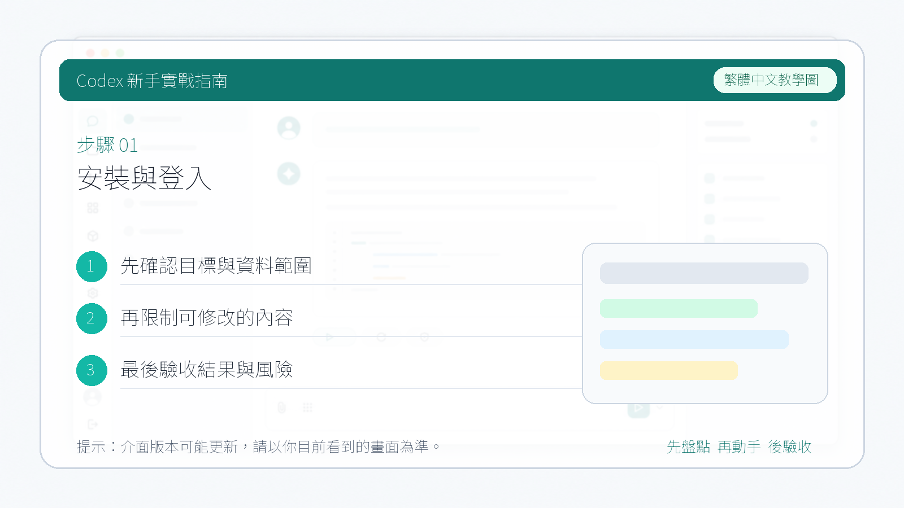

# 安裝與登入

本頁先覆蓋 Codex CLI 的安裝與登入。桌面端、ChatGPT、Cloud 和 IDE 入口會在 [入口地圖](/platform/) 中分別展開。

::: tip 最後核對
官方資料最後核對日期：2026-05-27。CLI 系統要求與安裝方式參考 [openai/codex 官方倉庫](https://github.com/openai/codex)、[CLI install 文件](https://github.com/openai/codex/blob/main/docs/install.md) 和 [Codex CLI Help Center](https://help.openai.com/en/articles/11096431-openai-codex-cli-getting-started)。
:::

## 安裝前檢查

官方倉庫當前給出的 CLI 執行環境建議：

| 專案 | 建議 |
| --- | --- |
| 作業系統 | macOS 12+、Ubuntu 20.04+/Debian 10+、Windows 11 透過 WSL2 |
| Git | 推薦 2.23+，便於 PR 輔助能力 |
| 記憶體 | 4GB 起步，8GB 更穩 |

本地先確認：

```bash
node -v
npm -v
git --version
```



## 安裝 CLI

常見安裝方式：

```bash
npm install -g @openai/codex
```

更新到最新版本：

```bash
npm install -g @openai/codex@latest
```

檢查版本：

```bash
codex --version
```


## 登入方式

執行：

```bash
codex
```

根據終端提示完成登入。官方資料說明 Codex 可以透過 ChatGPT 帳號在多個入口中使用，具體可用計劃、限額和組織策略以 [Codex in ChatGPT Help Center](https://help.openai.com/en/articles/11369540-codex-in-chatgpt) 為準。


## 第一次只讀任務

進入一個本地專案根目錄：

```bash
cd path/to/your/project
codex
```

先讓 Codex 只讀倉庫：

```text
請先閱讀這個倉庫的目錄結構、README、包管理器設定和測試設定。不要修改檔案。請總結：
1. 專案用途
2. 主要技術棧
3. 如何安裝依賴和執行測試
4. 你建議我下一步交給你的 3 個低風險任務
```


## 安裝失敗時怎麼判斷

| 現象 | 可能原因 | 處理方式 |
| --- | --- | --- |
| `codex` 命令找不到 | npm global bin 未進 PATH | 檢視 `npm bin -g`，把目錄加入 shell PATH |
| 登入後仍提示無權限 | 帳號計劃、組織策略或會話狀態問題 | 重新登入，並檢視 Help Center 中的計劃說明 |
| Windows 執行異常 | 未使用 WSL2 或 shell 環境不完整 | 按官方建議使用 Windows 11 + WSL2 |
| 倉庫命令跑不起來 | 專案依賴未安裝或本地環境缺失 | 先安裝專案依賴，再讓 Codex 讀取測試設定 |

完成後繼續：[第一次讓 Codex 改程式碼](./13-cli-first-run.md)。
