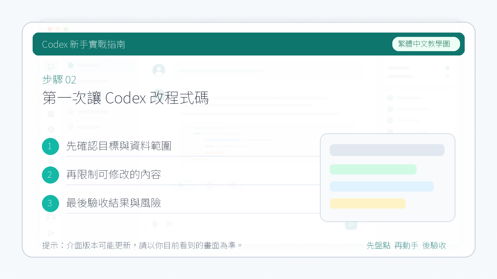

# 第一次讓 Codex 改程式碼

第一次實戰不要選擇“重構整個專案”。選擇一個小、可驗證、失敗也容易回滾的任務，先建立你和 Codex 的協作節奏。

::: tip 最後核對
官方資料最後核對日期：2026-05-27。本文參考 [Codex CLI features](https://developers.openai.com/codex/cli/features)、[openai/codex getting started](https://github.com/openai/codex/blob/main/docs/getting-started.md)、[AGENTS.md guide](https://developers.openai.com/codex/guides/agents-md) 與 [Codex security](https://developers.openai.com/codex/agent-approvals-security)。
:::

## 選擇第一個任務

適合新手：

- 修復一個文案錯別字。
- 給一個純函式補測試。
- 更新 README 裡的過期命令。
- 解釋一個小模組，並補充必要註釋。
- 修復一個已經有失敗測試覆蓋的 bug。

暫時避開：

- 大規模架構重構。
- 跨多個服務的遷移。
- 沒有測試的核心業務邏輯改動。
- 涉及生產憑據、帳單、權限和刪除資料的操作。
- 需要同時修改十幾個檔案的需求。

## 第一步：只讀建圖

先讓 Codex 理解倉庫：

```text
請只讀分析當前倉庫，不要修改檔案。

請輸出：
1. 專案用途
2. 關鍵目錄
3. 安裝、測試、構建命令
4. 當前任務適合從哪裡開始
5. 你建議我第一次交給你的低風險任務
```


## 第二步：給出小任務

推薦複製這個模板：

```text
請修復當前倉庫中最小範圍的一個測試失敗。

要求：
1. 先執行測試，確認失敗資訊。
2. 閱讀相關程式碼和測試，不做無關重構。
3. 修改最少必要檔案。
4. 修復後重新執行相關測試。
5. 最後總結：失敗原因、改了哪些檔案、驗證命令和剩餘風險。
```

如果任務是文件：

```text
請更新 [文件檔案] 中關於 [主題] 的說明。

要求：
1. 先讀取相關官方資料和現有文件結構。
2. 保持中文教程風格，避免整段翻譯官方原文。
3. 涉及操作步驟時標出需要補圖的位置。
4. 修改後執行文件站構建。
5. 最後列出來源連結和需要人工補圖的位置。
```



## 第三步：觀察過程

重點觀察五件事：

| 觀察點 | 說明 |
| --- | --- |
| 是否先讀上下文 | 好結果通常來自充分閱讀相關檔案 |
| 是否控制範圍 | 第一次任務不追求順手重構 |
| 是否解釋命令 | 命令執行前應說明目的 |
| 是否執行驗證 | 修改完成後要跑相關測試或構建 |
| 是否說明風險 | 沒能驗證的部分要如實記錄 |

## 第四步：檢查 diff

完成後自己再看一遍：

```bash
git diff
```

可以讓 Codex 自查：

```text
請 review 你剛才的改動，不要繼續修改檔案。

請重點檢查：
1. 是否有無關改動
2. 是否遺漏測試
3. 是否引入安全或相容風險
4. 是否還有未驗證的地方
```


## 第五步：提交前記錄

提交前讓 Codex 給出一段摘要：

```text
請用提交前摘要格式輸出：
- 改動目標
- 修改檔案
- 驗證命令
- 驗證結果
- 剩餘風險
- 建議 commit message
```

如果結果滿意，再提交：

```bash
git add .
git commit -m "fix: resolve failing test"
```

## 第一次失敗怎麼辦

| 失敗現象 | 處理方式 |
| --- | --- |
| 改動太大 | 讓 Codex 停下，只保留最小修復思路 |
| 測試跑不起來 | 先讓它解釋環境缺口和命令來源 |
| 方向不對 | 回到只讀分析，讓它列出檔案依據 |
| 輸出太泛 | 要求按檔案、命令、風險分段輸出 |
| 誤改無關檔案 | 用 git diff 確認，再手動決定保留或丟棄 |

## 完成標準

第一次實戰完成後，你應該拿到：

- 一個很小的 diff。
- 一條可復現的驗證命令。
- 一段清楚的改動摘要。
- 一個可複用的任務模板。
- 對 Codex 權限和審核的初步理解。

下一步繼續讀：[瞭解 Codex 基本組成](./03-app-overview.md)。
