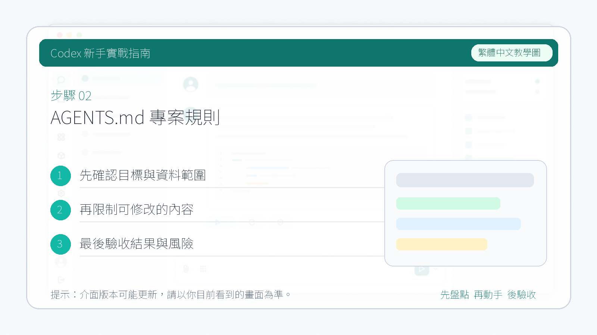

# `AGENTS.md` 專案規則

對於 Codex 而言，我們每開啟一個新的對話視窗，它都會進入一個全新的上下文。它不記得之前發生了什麼，對於整個專案的記憶都是空白的。

所以 Codex 提供了記憶系統來解決這樣的問題

`AGENTS.md` 是給 Codex 這類編碼代理看的專案說明檔案。它可以描述專案結構、開發命令、測試要求、程式碼風格和協作邊界。

::: tip 最後核對
`AGENTS.md` 機制請以 [Codex AGENTS.md 官方文件](https://developers.openai.com/codex/guides/agents-md) 和 [openai/codex GitHub repository](https://github.com/openai/codex) 為準。最後核對日期：2026-05-27。
:::

## 為什麼需要 `AGENTS.md`

沒有專案規則時，Codex 需要從倉庫裡推斷很多事情：

- 用哪個包管理器。
- 如何執行測試。
- 哪些目錄是生成物。
- 哪些檔案不能改。
- 提交前要跑哪些檢查。

`AGENTS.md` 能把這些規則顯式寫下來，減少反覆解釋。

## 建議放在倉庫哪裡

針對於我們開啟的專案，我們可以在專案根目錄下建立一個 `AGENTS.md` 的檔案。

它是 Codex 的記憶檔案，Codex 在開始工作之前會先讀取 `AGENTS.md` 的內容。我們可以測試一下：
1. 在 `AGENTS.md` 檔案裡面寫入一些內容。


1. 回到 Codex 對話視窗問它：“這是一個什麼樣的系統？”



從這裡可以看出，Codex 會讀取 `AGENTS.md` 檔案，把裡面的內容自動帶入到新的對話，作為它們的上下文。

當然，在當前目錄根目錄下建立 `AGENTS.md` 只對當前資料夾生效，並不是全域性生效的。

如果想要全域性生效，有以下兩種方式：
1. 在系統的全域性 Codex 資料夾裡面找到 `AGENTS.md`。
2. 在 Codex 桌面 App 裡面開啟設定，找到“個性化”，在其中填寫“自定義指令”。這裡面設定的就是全域性的 `AGENTS.md` 檔案。

設定全域性檔案後，對於所有的專案都會生效。所以它們的作用域和作用範圍是不一樣的，這一點大家需要了解一下。


## 推薦模板

```markdown
# AGENTS.md

## 專案概覽

- 專案型別：
- 主要語言：
- 關鍵目錄：

## 常用命令

- 安裝依賴：`...`
- 本地開發：`...`
- 執行測試：`...`
- 型別檢查：`...`
- 格式化：`...`

## 程式碼規範

- 遵循現有程式碼風格。
- 不做無關重構。
- 新增功能必須補充或更新測試。

## 安全邊界

- 不讀取或提交 `.env`、金鑰和私有憑據。
- 不執行刪除生產資料的命令。
- 修改資料庫遷移前先說明影響。

## 交付要求

- 說明改動檔案。
- 說明驗證命令和結果。
- 說明未驗證項和剩餘風險。
```

## 寫作建議

- 越具體越好。`執行測試：pnpm test` 比“記得測試”有用。
- 把生成目錄、構建產物、鎖檔案策略寫清楚。
- 如果是 monorepo，請說明每個包的邊界。
- 如果有特殊 lint、格式化或程式碼生成流程，寫在命令區。
- 對安全敏感專案，單獨寫“禁止事項”。

## 最小可用版本

```markdown
# AGENTS.md

## 專案命令

- 安裝依賴：`pnpm install`
- 本地開發：`pnpm dev`
- 構建：`pnpm build`

## 改動規則

- 修改前先閱讀相關檔案。
- 保持現有程式碼風格。
- 不提交構建產物和環境變數檔案。

## 驗證要求

- 文件改動執行：`pnpm build`
- 程式碼改動執行相關測試。

## 安全邊界

- 不讀取 `.env` 或任何私有憑據。
- 不執行釋出、部署、資料庫遷移和刪除資料命令。
```
