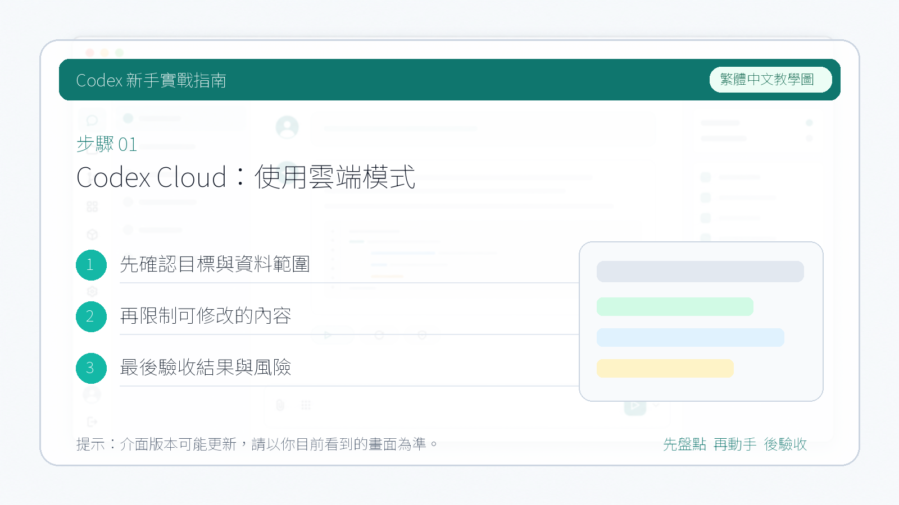

# Codex Cloud：使用雲端模式

Codex Cloud 是一種不依賴本地環境的使用方式。你不需要在自己電腦上開啟 App 或 CLI，直接在瀏覽器裡連線 GitHub 倉庫，讓 Codex 在雲端完成任務。

::: tip
CLI 的使用方式見 [CLI 安裝與登入](./12-cli-installation.md)，IDE 外掛見 [在 VS Code 中使用 Codex](./14-ide-vscode.md)，桌面 App 的使用見 [Codex 桌面 App 下載與安裝](./01-app-installation.md)。
:::

---

## 適合場景

- 較長的任務，不想佔用本地資源
- 多個任務並行推進
- 讓 Codex 在獨立環境裡分析倉庫、提出 PR
- 不在電腦旁、只有瀏覽器時臨時使用

---

## 如何使用

### 第 1 步：開啟 Codex Cloud

訪問：[https://chatgpt.com/codex/cloud](https://chatgpt.com/codex/cloud)

連線成功後會跳轉到任務頁面：

### 第 2 步：授權並選擇倉庫

Cloud 模式直接在 GitHub 倉庫中執行，需要先完成授權。你可以授權全部倉庫，也可以只選擇特定倉庫：

### 第 3 步：下達指令，檢視任務進度

下達指令後，Codex 會在雲端執行任務，進度顯示在頁面下方的任務列表裡：

點選任務可以檢視每一步的執行過程和中間狀態。任務完成後也可以檢視最終回答和產出內容：

---

## 與桌面 App 模式的區別

| | Codex 桌面 App | Codex Cloud |
|---|---|---|
| 執行環境 | 本地電腦 | 雲端（GitHub 環境） |
| 是否需要安裝 | 需要下載電腦端客戶端 | 不需要，瀏覽器直接訪問 |
| 適合任務 | 原生代碼、外掛、自動化 | 遠端倉庫分析、PR 生成 |
| 並行任務 | 支援 | 支援 |
