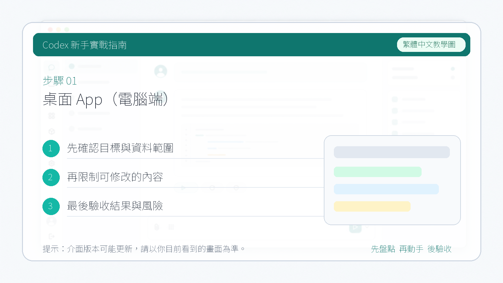

# 桌面 App（電腦端）

這裡的桌面 App 指電腦端客戶端，不是手機 App。它更像一個本地 Codex 工作台，適合在一個專案裡管理多條任務線：你可以讓不同 agent 並行探索、實現、驗證，也可以用 Skills、Automations、Worktrees 和外掛化能力沉澱長期流程。

::: tip 最後核對
官方資料最後核對日期：2026-05-27。本文參考 [Codex 桌面 App 文件](https://developers.openai.com/codex/app)、[Codex 文件入口](https://developers.openai.com/codex/)、[Codex Skills](https://developers.openai.com/codex/skills) 與 [Introducing the Codex app](https://openai.com/index/introducing-the-codex-app/)。
:::

## 桌面 App 適合什麼

- 本地倉庫中的長任務和多階段任務。
- 同時推進多個不互相阻塞的任務。
- 使用 Worktrees 隔離不同實現分支。
- 把重複流程寫成 Skills。
- 用 Automations 做提醒、定期檢查或後續跟進。
- 配合瀏覽器、文件、表格、簡報等外掛做跨工具工作。

## 核心能力地圖

| 能力 | 用途 | 學習重點 |
| --- | --- | --- |
| Projects | 組織本地工作區和任務歷史 | 每個專案都先確認 Git 狀態 |
| Agents | 分配探索、實現、驗證任務 | 並行任務要有清晰邊界 |
| Worktrees | 隔離不同分支的檔案改動 | 適合多方案對比和長任務 |
| Local Environments | 為任務準備依賴、命令、環境 | 寫清安裝、構建、測試步驟 |
| Review | 檢查 diff 和結果 | 先看風險，再看風格 |
| Skills | 固化複雜流程 | 把高頻提示詞變成可複用能力 |
| Automations | 延遲或週期性任務 | 輸出要自包含，避免靜默改動 |
| In-app Browser / Computer Use | 檢查頁面、點選操作、截圖驗證 | 適合前端和資料核對任務 |

## 一個推薦的本地任務流

1. 開啟專案，確認分支和未提交改動。
2. 讓 Codex 只讀總結倉庫結構。
3. 把任務拆成探索、實現、驗證。
4. 需要並行時，為每個 agent 指定檔案範圍。
5. 修改後執行驗證命令。
6. Review diff，並要求 Codex 輸出風險和剩餘問題。
7. 把成功流程沉澱為 Skill 或案例。

## Worktrees 的使用場景

Worktrees 適合處理“多個方向都值得試”的任務：

- 兩種實現方案對比。
- 修復同一個 bug 的不同思路。
- 同時推進文件和程式碼改動。
- 長任務中保留一個乾淨分支。

實踐建議：

- 每個 worktree 只處理一個目標。
- 分支名體現任務，例如 `codex/fix-login-test`。
- 合併前讓 Codex 總結兩個方案差異。
- 不要讓多個任務同時修改同一批核心檔案。

## Local Environments

Local Environments 關注“Codex 在哪裡執行、有哪些依賴、能執行哪些命令”。對於知識庫教程，你可以把它理解為任務可復現性的基礎。

建議為專案整理：

- 依賴安裝命令。
- 測試命令。
- 構建命令。
- 需要的系統服務。
- 必需環境變數的佔位說明。
- 禁止暴露的 secret 清單。

## Skills 與 Automations

桌面 App 很適合把經驗固化下來。

適合寫 Skill：

- PR review。
- 文件站構建檢查。
- 前端截圖驗證。
- 案例收集。
- 釋出前 checklist。

適合做 Automation：

- 每週檢查文件斷鏈。
- 每天彙總失敗 CI。
- 任務完成後隔天提醒補覆盤。
- 定期檢查官方文件更新。

## 適合非開發者的任務

- 把技術 PR 改寫成產品釋出說明。
- 梳理專案文件缺口。
- 生成會議前技術背景材料。
- 從 issue 中提取行動項。
- 檢查知識庫結構是否適合新手閱讀。

## 風險邊界

- 並行 agent 寫檔案前必須劃清檔案範圍。
- 涉及刪除、安裝依賴、網路訪問、釋出部署時保留人工確認。
- 截圖和日誌進入開源倉庫前要遮擋敏感資訊。
- Automation 要有明確輸出，不要預設寫回外部系統。

## 官方資料

- [Codex 桌面 App 文件](https://developers.openai.com/codex/app)
- [Codex Skills](https://developers.openai.com/codex/skills)
- [Codex security](https://developers.openai.com/codex/agent-approvals-security)
