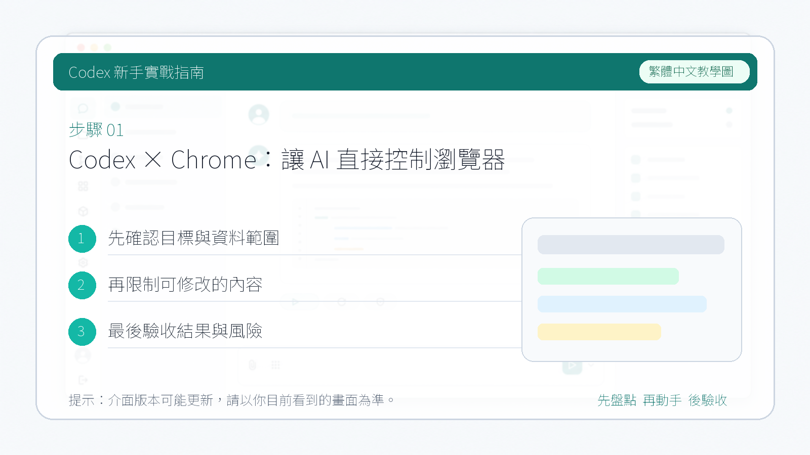

# Codex × Chrome：讓 AI 直接控制瀏覽器

這個案例介紹如何讓 Codex 藉助瀏覽器相關能力完成網頁操作任務，比如開啟頁面、搜尋內容、點選結果和返回連結。

::: tip 最後核對
官方資料最後核對日期：2026-05-27。本文參考 [Using Codex with your ChatGPT plan](https://help.openai.com/en/articles/11369540-using-codex-with-your-chatgpt-plan) 與 [Codex use cases](https://developers.openai.com/codex/explore/)。具體外掛名稱、安裝流程和入口位置可能會隨客戶端版本或工作區設定變化。
:::

## 適用場景

- 讓 Codex 幫你在網頁裡搜尋資料。
- 讓 Codex 開啟某個站點並完成簡單點選流程。
- 在不離開當前工作區的前提下，把瀏覽器操作接入任務鏈路。

## 使用前先理解一件事

這裡說的“控制瀏覽器”，更準確地說，是讓 Codex 藉助瀏覽器或瀏覽器外掛能力去完成網頁互動。不同工作區裡，入口可能叫 `Chrome`、`Browser`，也可能表現為瀏覽器外掛或內建瀏覽能力。

因此，更穩妥的理解方式是：

1. 在當前工作區確認是否已經啟用了相關瀏覽器能力。
2. 如果是第一次使用，按介面引導完成瀏覽器側安裝或授權。
3. 安裝完成後，再在任務裡明確告訴 Codex 你想讓它做什麼。

## 一個常見流程

如果你的客戶端提供了 Chrome 相關外掛或瀏覽器能力，常見流程通常類似這樣：

1. 在 Codex 桌面 App 中找到對應的瀏覽器能力並啟用。
2. 按引導完成瀏覽器側的外掛安裝或連線設定。
3. 回到任務中，明確描述目標網頁、搜尋詞和預期輸出。



第一次點選後會跳轉到瀏覽器外掛安裝頁，點選新增擴充套件即可


## 任務示例

你可以像下面這樣給出一個明確任務：

```text
請使用瀏覽器能力開啟 Bilibili，搜尋“RAG 知識庫 教程”，找一個適合新手入門的影片，並把標題和連結返回給我。
```

一個類似任務完成後，Codex 可能會：

1. 開啟目標站點。
2. 搜尋你提供的關鍵詞。
3. 進入相關結果頁。
4. 把它認為最合適的結果連結返回給你。


## 你要重點檢查什麼

- 它開啟的網站是不是你指定的那個站點。
- 搜尋詞有沒有被錯誤改寫。
- 點選結果後返回的是不是你真正需要的頁面，而不是廣告頁或無關頁。
- 如果涉及登入態、個人資料或付費後臺，是否會超出你願意授權的範圍。

## 風險提醒

- 瀏覽器相關能力通常比純文字任務權限更高，第一次使用時建議從只讀、低風險頁面開始。
- 不要直接讓 Codex 操作帶有支付、刪除、發帖、提交表單等高風險頁面，除非你準備全程複核。
- 如果教程依賴外掛安裝，未來介面名稱或入口位置可能變化，因此文件裡應優先描述“能力和流程”，而不是把某個按鈕位置寫死。
