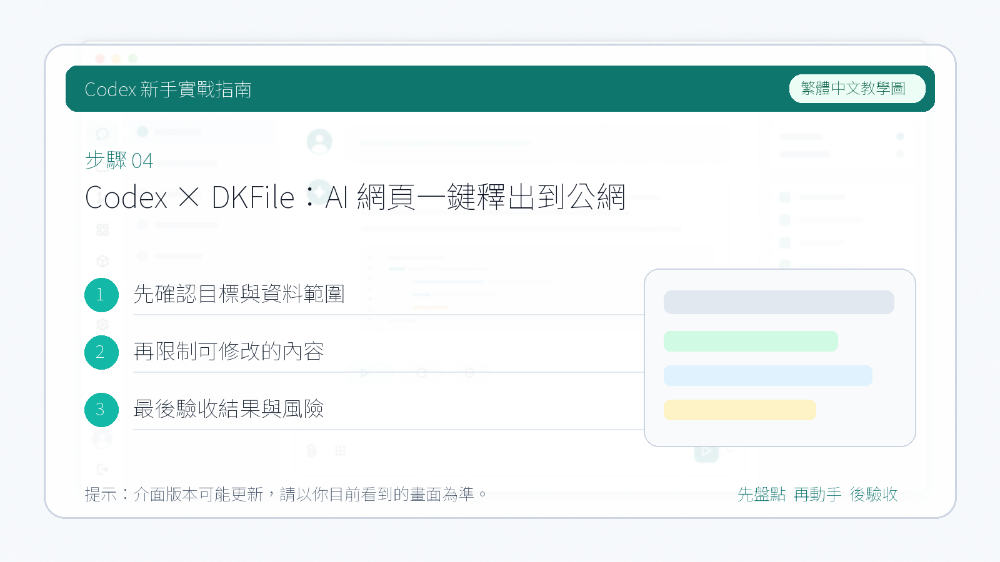

# Codex × DKFile：AI 網頁一鍵釋出到公網

用 AI 做出來的 HTML 網頁，很多人卡在同一個問題：**網頁只在本地，發給朋友根本打不開**。

對有程式設計經驗的人來說，解決方法有很多——GitHub Pages、Cloudflare Pages——但這些工具對普通使用者並不友好：什麼是分支？什麼是部署？什麼是域名解析？

本篇介紹一個對新手極其友好的工具：**[DKFile](https://dkfile.net)**。

---

## DKFile 的優勢

- **極簡操作：** 把 AI 生成的 HTML 上傳上去，DKFile 自動完成所有託管工作
- **一鍵生成：** 點選上傳，自動獲得公網訪問連結
- **無需設定：** 不需要推送程式碼、不需要填寫設定、不需要懂任何部署知識

---

## 1. 手動上傳使用

先去 DKFile 註冊帳號（有免費額度，普通使用者完全夠用）：

> 註冊地址：[https://dkfile.net/register?code=ZHUZHAOYU](https://dkfile.net/register?code=ZHUZHAOYU)

註冊完成後，用 AI 設計好 HTML 頁面，點選右下角的"**上傳檔案**"：


操作流程：

1. 點選"上傳檔案"，選擇本地的 HTML 檔案
2. 點選"上傳"，系統自動完成託管
3. 上傳完成後**直接獲得公網訪問連結**，即可分享給任何人


---

## 2. Codex + DKFile API 全自動化

手動上傳還是要開啟網站、找檔案、點按鈕。其實這個流程可以完全交給 Codex 自動完成。

DKFile 提供了 API 文件，整體流程是：

1. 讓 Codex 閱讀 DKFile 的 API 文件
2. Codex 完成網頁製作後，自動呼叫 API 上傳檔案
3. 直接返回公網訪問連結

**整個過程你不需要開啟瀏覽器，不需要手動上傳，全部自動化。**

### 具體步驟

首先讓 Codex 閱讀 API 文件，它會告訴你需要準備什麼（主要是你的 **API Key**）：


點選 DKFile 後臺的"API 對接文件"，按照說明建立自己的 API Key（不懂直接問 Codex，它會引導你）。

然後把你的 API Key 和設計需求一起發給 Codex，比如：

```
幫我設計一個 Obsidian 新手使用教程的 HTML 網頁，
設計完成後使用 DKFile API（Key: xxx）自動上傳並返回公網連結。
```

Codex 會自動完成設計、呼叫 API 上傳，最後告訴你檔案位置和**可直接訪問的公網連結**：



---

## 總結

| 方式 | 適合人群 | 操作難度 |
|------|----------|----------|
| DKFile 手動上傳 | 完全不懂部署的新手 | ⭐ 極簡 |
| Codex + DKFile API | 想要全自動化的使用者 | ⭐⭐ 簡單 |
| GitHub Pages | 有程式設計基礎的使用者 | ⭐⭐⭐ 需要學習 |

對於普通使用者，DKFile 是目前最無門檻的 AI 網頁釋出方案。用 Codex 生成、用 DKFile 釋出，從創意到上線，全程不需要懂任何技術。
