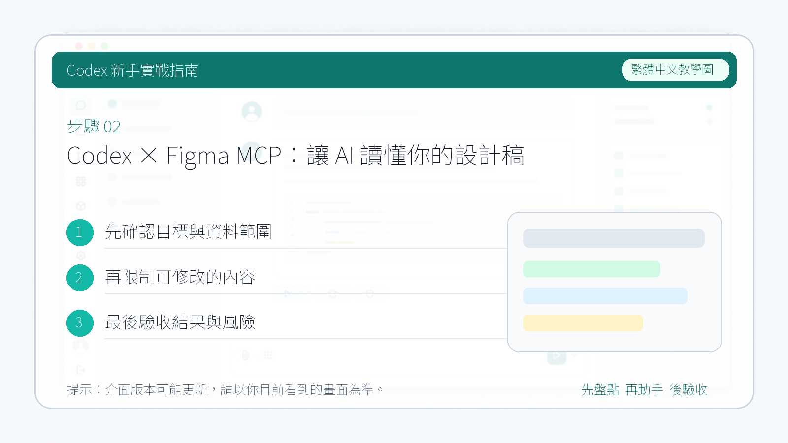

# Codex × Figma MCP：讓 AI 讀懂你的設計稿

**Figma MCP** 能讓 Codex 直接讀取設計稿、截圖分析節點、生成頁面、修改元件、繪製流程圖。安裝之後，你只需要用自然語言下達設計需求，剩下的交給 Codex 去完成。

---

## 1. 安裝

在 Codex 桌面 App 的外掛市場搜尋 **Figma**，點選安裝。

安裝後會跳轉到瀏覽器頁面完成授權（流程和 Notion MCP 類似，按提示操作即可）。

---

## 2. 如何使用

新建對話，用 `@` 符號呼叫 Figma MCP，然後直接描述你的需求。

**示例一：生成流程圖**

讓它生成一個包含基本操作步驟的使用者登入流程圖：

點選返回的連結，在瀏覽器裡檢視生成的登入註冊流程圖效果：

**示例二：生成高保真 UI 設計圖**

如果你覺得流程圖太偏技術，可以讓它設計產品功能架構圖，或者生成海報式的高保真 UI。直接發提示詞即可：

點選連結檢視效果，整體呈現非常不錯：

---

## 總結

Figma MCP 特別適合有設計需求的朋友。在 Codex 裡裝上這個外掛，就可以用對話的方式完成以前需要專業設計技能才能做的事情。

當畫圖的門檻被 AI 拉低之後，我們真正需要培養的能力是：

1. **產品思維** — 知道要做什麼
2. **業務理解** — 知道為什麼這樣做
3. **審美標準** — 知道什麼是好的

讓 Codex 當執行者，藉助 Figma MCP 去放大你的想法，設計出屬於自己的作品。
