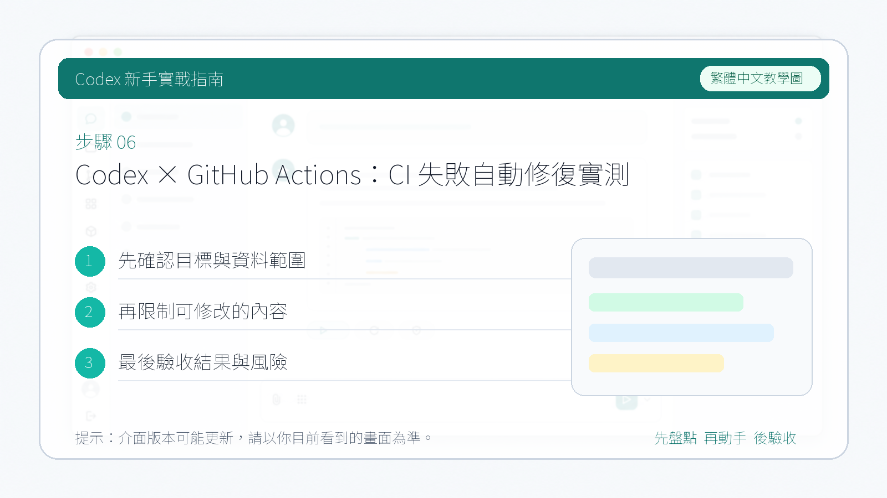

# Codex × GitHub Actions：CI 失敗自動修復實測

這篇文章記錄了一次真實的實測：CI 一掛，Codex 自動讀程式碼、找問題、改好、開 PR，等你合併，全程不需要人工介入。

演示用的是一個購物車專案。

------

## 傳統方式是什麼樣的

CI 失敗是開發日常裡很常見的事，但處理起來並不輕鬆。

通常的流程是這樣的：收到郵件或訊息通知 → 開啟 CI 日誌，逐行看報錯 → 切換到本地，找到出問題的程式碼 → 修復、提交、再推一次 → 等 CI 重新跑，確認透過 → 開 PR，等人審查合併。

整個鏈路全靠人在中間串起來。如果報錯資訊不明確，還要加上一段排查時間。遇到下班時間或者跨時區協作，一個 CI 失敗拖到第二天才處理也很正常。

引入 Codex 之後，這條鏈路發生了變化：CI 一失敗，工作流自動觸發 Codex，它自己讀程式碼、定位問題、修好、開 PR。你需要做的，只是最後審一眼、點 Merge。

------

## 錯誤發生在哪裡

專案的核心邏輯是計算購物車總價，滿 100 減 20。

折扣函式里埋了一個 bug：減號被寫成了加號。

```javascript
// 錯誤的程式碼
if (total >= 100) {
    return total + 20;  // 應該是減號
}
```

效果是：原價 120 元的商品，打完折後變成 140 元，越打折越貴。

------

## 提交後 CI 報了什麼錯

程式碼推到 GitHub 後，CI 自動跑測試，大約一分鐘後失敗。


點進去看報錯：


測試期望拿到 100，實際拿到 140。錯誤直接指向了折扣計算的問題，非常明確。

------

## 設定檔案長什麼樣

讓 Codex 自動介入的關鍵，是在倉庫裡放一個 GitHub Actions 工作流檔案。完整設定如下：

```yaml
name: Codex Auto-Fix on Failure
on:
  workflow_run:
    workflows: ["CI"]
    types: [completed]
permissions:
  contents: write
  pull-requests: write
jobs:
  auto-fix:
    if: ${{ github.event.workflow_run.conclusion == 'failure' }}
    runs-on: ubuntu-latest
    env:
      OPENAI_API_KEY: ${{ secrets.OPENAI_API_KEY }}
      FAILED_WORKFLOW_NAME: ${{ github.event.workflow_run.name }}
      FAILED_RUN_URL: ${{ github.event.workflow_run.html_url }}
      FAILED_HEAD_BRANCH: ${{ github.event.workflow_run.head_branch }}
      FAILED_HEAD_SHA: ${{ github.event.workflow_run.head_sha }}
    steps:
      - name: Checkout Failing Ref
        uses: actions/checkout@v4
        with:
          ref: ${{ env.FAILED_HEAD_SHA }}
          fetch-depth: 0
      - name: Setup Node.js
        uses: actions/setup-node@v4
        with:
          node-version: '20'
      - name: Install dependencies
        run: npm install
      - name: Run Codex
        uses: openai/codex-action@main
        with:
          openai-api-key: ${{ secrets.OPENAI_API_KEY }}
          prompt: "這是一個 Node.js 專案，使用 Jest 做測試。請讀取倉庫程式碼，執行測試套件，找到導致測試失敗的最小改動範圍，修復它，然後停止。不要修改與失敗無關的程式碼。"
          sandbox: workspace-write
      - name: Verify tests pass
        run: npm test --silent
      - name: Create Pull Request
        if: success()
        uses: peter-evans/create-pull-request@v6
        with:
          commit-message: "fix: Codex 自動修復失敗的測試"
          branch: codex/auto-fix-${{ github.event.workflow_run.run_id }}
          base: ${{ env.FAILED_HEAD_BRANCH }}
          title: "🤖 Codex 自動修復 CI 失敗"
          body: |
            Codex 檢測到 CI 失敗，自動生成了這個修復 PR。

            失敗的工作流：${{ env.FAILED_WORKFLOW_NAME }}
            失敗記錄連結：${{ env.FAILED_RUN_URL }}

            請檢查改動內容，確認無誤後合併。
```

幾個值得注意的地方：

**觸發與過濾**：監聽名為 "CI" 的工作流，等它跑完再判斷結果。`conclusion == 'failure'` 確保只在失敗時才真正執行，成功的話這個 job 直接跳過，不消耗資源。

**記錄失敗現場**：把失敗那次 run 的分支、提交 SHA、日誌連結都存進環境變數。這些資訊最終會寫進 PR 描述，方便事後追溯是哪次 CI 觸發了這個修復。

**檢出失敗的程式碼**：`ref: ${{ env.FAILED_HEAD_SHA }}` 拉取失敗那次提交的程式碼，確保 Codex 改的是真正出問題的版本。

**Codex 修復**：使用官方的 `openai/codex-action@main`，prompt 用中文寫清楚要求——跑測試、找最小改動範圍、修完停手，不碰無關程式碼。`sandbox: workspace-write` 允許它寫檔案。

**先驗證再開 PR**：Codex 改完後先跑一次 `npm test`，確認測試透過了才執行 `create-pull-request`。`if: success()` 保證改錯了的話不會開出一個還是紅的 PR。

------

## 告訴 Codex 去做什麼

CI 失敗後，設定好的 Codex 工作流自動觸發。它做了三件事：讀取倉庫程式碼、執行測試套件、定位問題並修改。


整個過程大約一分鐘。

------

## 修復過程中遇到了什麼問題

實測踩了兩個坑，記錄在這裡。

**第一個坑：PR 權限沒開**

Codex 改好了程式碼，但開 PR 那步報錯：

```
Error: GitHub Actions is not permitted to create or approve pull requests.
```

GitHub 倉庫預設不允許 Actions 建立 PR，需要在 Settings 裡手動開啟。


開啟後重新觸發，正常。

**第二個坑：失敗也計費**

除錯階段反覆觸發了幾次，最終帳單是 $0.40。

API 按 token 計費，不按成功次數——只要 AI 啟動並讀了程式碼，費用就已經產生。正常情況下一次成功的修復大約 $0.05–$0.10，多花的是除錯成本。

------

## 修復成功後的結果

工作流跑完變綠，Pull Requests 頁面出現一條自動生成的 PR。


點進去看它改了什麼：



就改了這一個字元，其他程式碼一行沒動。

點 Merge，完成。

------

## 小結

這次實測驗證了 Codex 透過 GitHub Actions 自動修復 CI 的能力是真實可用的——能準確定位問題、只改必要的程式碼、修完自動開 PR。

有兩點值得提前瞭解：一是 GitHub 倉庫的 PR 權限需要手動開啟，否則最後一步會失敗；二是 API 按用量計費，除錯階段的失敗也會產生費用，建議在 OpenAI 後臺設定一個月度消費上限。
