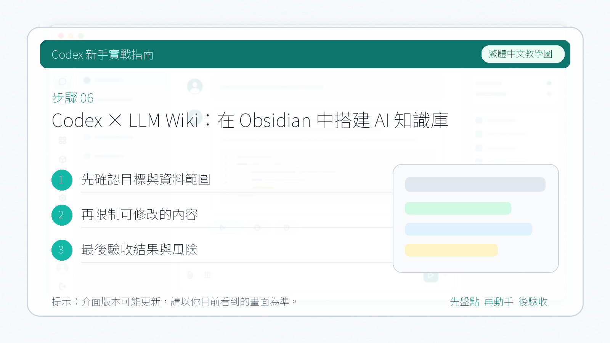

# Codex × LLM Wiki：在 Obsidian 中搭建 AI 知識庫

大部分人使用大模型處理文件都停留在 **RAG 模式**（檢索增強生成，Retrieval-Augmented Generation）。這是當前 AI 行業最主流的知識管理正規化：上傳檔案，提問時系統檢索相關片段，讓大模型基於這些片段生成回答。NotebookLM、ChatGPT 的檔案上傳，以及幾乎所有的企業級知識庫走的都是這條路。

前段時間，AI 領域的著名研究者 **Andrej Karpathy** 提出了一個新想法。他認為 RAG 的主要問題在於：**每一次提問，模型都要從零開始重新發現知識**。如果你問了一個需要綜合五篇文件的問題，RAG 會檢索、拼接、生成；如果你明天再問同樣的問題，它會重複整個過程，沒有任何積累，也沒有任何記憶。本來可以建立關聯的知識，卻在一次又一次的反覆查詢中被浪費掉了。

Karpathy 給出的解決方案是 **LLM Wiki**。他描述的系統分為三層：

1. **原始資料層** — 負責收集論文、文章、播客、網頁等素材。大模型對這一層只讀不改。
2. **Wiki 層** — 大模型擁有這一層的完整所有權。它負責編寫 Markdown 檔案、目錄、摘要、實體概念、比較分析和綜述，建立頁面、更新頁面，並維護交叉引用。我們只需要負責閱讀。
3. **Schema 層** — 一個設定檔案，例如對於 Codex 來說就是 `AGENTS.md`，對於 Cursor 來說就是 `.cursorrules`。告訴大模型這個 Wiki 的結構規範、命名約定和工作流程，並在使用過程中共同迭代這份檔案。


本篇介紹如何參考 Karpathy 的理念，在 Obsidian 裡藉助 Codex 搭建一套 LLM Wiki 知識庫。

---

## 1. 參考 Karpathy 的 GitHub 倉庫

首先找到 Karpathy 分享的 LLM Wiki 原始設計文件，瞭解他的設計理念：

[https://gist.github.com/karpathy/442a6bf555914893e9891c11519de94f](https://gist.github.com/karpathy/442a6bf555914893e9891c11519de94f)

---

## 2. 在 Obsidian 裡建立 Wiki 倉庫

在本地新建一個 Obsidian 倉庫，然後把以下提示詞發給 Codex：

```
你現在是我的 LLM Wiki Agent。
把下面這份 idea 檔案原樣落地，作為我完整的第二大腦，一步一步地執行，
建立擁有完整規則的系統。落地過程嚴格參考以下 GitHub 倉庫的內容：
https://gist.github.com/karpathy/442a6bf555914893e9891c11519de94f
```

Codex 會根據內容幫你建立一套符合 LLM Wiki 理念的本地知識庫結構：


建立完成後，倉庫裡會生成以下檔案和資料夾：

- `concept/`
- `raw/`
- `logs/`
- `wiki/`
- `AGENTS.md`
- `log`

這些都符合 Karpathy 描述的 LLM Wiki 架構。

---

## 3. 如何使用

### 安裝 Obsidian Web Clipper

首先安裝瀏覽器外掛 **Obsidian Web Clipper**。它的作用是將瀏覽器中的文章、影片、網頁內容自動提取並下載到本地倉庫，方便讓 Codex 進行處理和拆分。


### 抓取文章到 raw 資料夾

找一篇想納入知識庫的文章，用外掛將其儲存到倉庫裡的 `raw/` 資料夾（在 Karpathy 的理念中，`raw/` 專門存放原始素材）。點選"新增到 Obsidian"即可。


### 讓 Codex 完成入庫

開啟 Obsidian，讓 Codex 讀取這篇文章：


Codex 會自動閱讀內容，按照 LLM Wiki 的理念進行拆分，新增摘要、實體、關聯引用等頁面。完成後，它會告訴你具體新增了哪些內容，這篇文章就正式入庫了。



### 持續迭代

後續想研究同一主題的更多內容，重複以下流程即可：

1. 用 **Obsidian Web Clipper** 把新文章儲存到 `raw/`
2. 讓 Codex 將其拆分成多個 Wiki 頁面，並更新相關檔案的交叉引用
3. 隨著內容積累，知識之間的關聯會越來越清晰，形成真正結構化的第二大腦

---

## 參考來源

本文核心概念參考 [Andrej Karpathy 的 LLM Wiki idea](https://gist.github.com/karpathy/442a6bf555914893e9891c11519de94f)。實作時請依你的資料夾結構、命名規則和同步工具調整。
