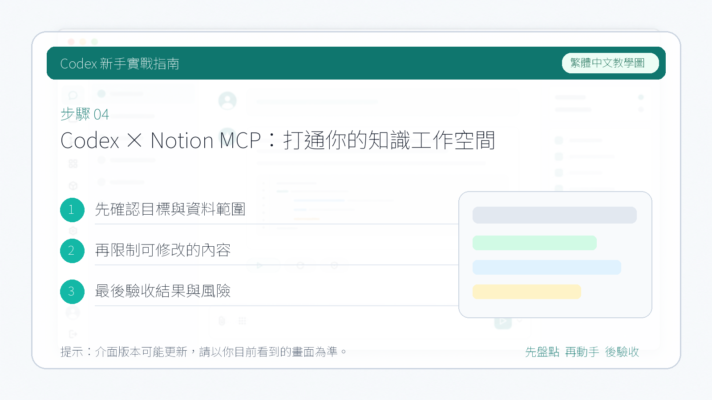

# Codex × Notion MCP：打通你的知識工作空間

**Notion** 不只是一款筆記軟體——它在 AI 時代完成了轉型，成為了真正的 AI Native 產品。透過 Notion MCP，你可以讓 Codex 直接讀取、總結和寫入你的 Notion 工作空間，實現真正的 AI 驅動知識管理。

---

## 1. 安裝

開啟 Codex 外掛市場，搜尋 **Notion**，點選安裝。

Notion 的權限涉及較多，安裝時會跳轉到瀏覽器，需要登入你的 Notion 帳號並完成授權，讓 Codex 可以透過 MCP 訪問你的工作空間：

1. 按照提示完成手動授權
2. 授權成功後系統會提示返回 Codex
3. Codex 自動完成設定

設定完成後，直接用 `@` 呼叫 Notion 外掛即可。

---

## 2. 如何使用

### 讀取工作空間內容

先讓 Codex 呼叫 Notion MCP，驗證它能否正常讀取你的工作空間內容。成功返回說明連線沒有問題：

### 讀取其他工作空間

如果你加入了其他人的工作空間，只要對方提供了對應的 API 文件，把文件給 Codex，讓它完成連線操作即可。

下圖是讓 Codex 檢視我加入的一個工作空間**昨天更新的內容**，在授權範圍內，讀取完全正常：

### 總結與寫入

讀取到內容之後，可以讓 Codex 直接進行總結。如果對話中產生了不錯的想法，也可以讓它**直接寫入到你的 Notion 工作空間**，完成後會返回一個寫入成功的連結：

點選連結跳轉到 Notion 檢視寫入結果，內容完全正常：

---

## 總結

Notion MCP 讓 Codex 真正成為你知識管理的助手——不只是聊天，而是可以**讀取、理解、寫入**你的工作空間。對於重度 Notion 使用者來說，這是一個值得上手的組合。
