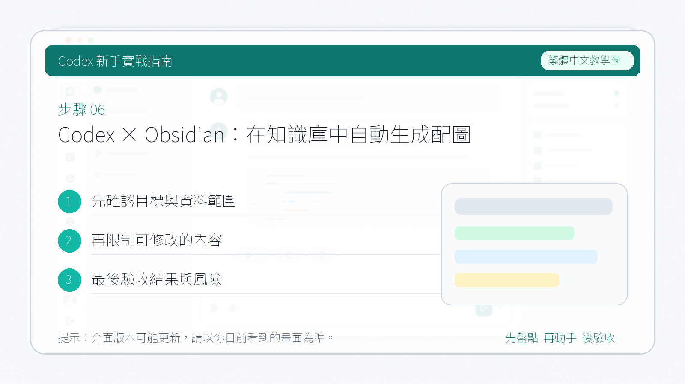

# Codex × Obsidian：在知識庫中自動生成配圖

**Obsidian** 是本地優先的知識管理工具。隨著 Agent 能力的增強，Obsidian 的使用方式也在發生變化。本篇介紹如何在 Obsidian 裡使用 Codex，完成日常的內容創作流程。

內容創作者以前有一件很頭疼的事：**給文章配圖**。但自從 Codex 命令列可以直接呼叫 ChatGPT 最新的生圖模型 `gpt-image-2` 之後，我們就可以在 Obsidian 裡讓 Codex 根據文章內容自動生成配圖。

**前提條件：**

1. 瞭解 Obsidian 的基本操作
2. 熟悉 Codex 命令列的使用方式（參見本教程第二部分）

---

## 1. 在 Obsidian 裡安裝 Terminal 外掛

首先安裝 **Terminal** 外掛，如圖所示：

安裝完成後需要進行設定，否則無法正常使用：

在設定中選擇想要的終端輸入方式：

---

## 2. 開啟終端

按 `Cmd+P` 調出命令面板，輸入"終端"，選擇**整合式**：

此時頁面下方會出現一個命令列介面：

---

## 3. 登入 Codex

如果之前已經登入過 Codex，直接在這個終端裡輸入 `codex` 即可使用。如果沒有登入過，參照本教程第二部分（CLI 使用 Codex）完成設定：

---

## 4. 開始使用

登入成功後，Codex 已經可以完整讀取你本地 Obsidian 倉庫裡的所有內容，並執行以下操作：

1. **寫入文件** — 直接在倉庫中新建或修改 Markdown 檔案
2. **生成配圖** — 指定文章內容，讓 Codex 根據正文自動生成配圖並插入對應位置

成功出圖：

生成效果如圖所示：

**監聽圖床自動上傳** — 如果你使用物件儲存（如 PicGo），可以告訴 Codex 監聽圖片儲存事件，識別後自動上傳

如果他沒有上傳的話，你就可以告訴他，讓他去你的本地查詢你有哪些圖床。他會搜尋所有的圖床類別，如果你想讓他快點找到的話，就直接告訴他你用的是什麼圖床、用的是什麼上傳工具，這樣的話他就會快速定位。

然後它會自己自動完成這個任務，最後返回給我們一個對應圖床的連結。

大家可以盡情嘗試，把 Obsidian 變成真正由 AI 驅動的創作工作台。

---

## 參考來源

Obsidian 是本地筆記工具，實際工作流請依你的 vault 結構、同步方式和外掛設定調整。若要接雲端知識庫，台灣團隊也可以替換成 Notion、Google Drive 或 GitHub Wiki。
