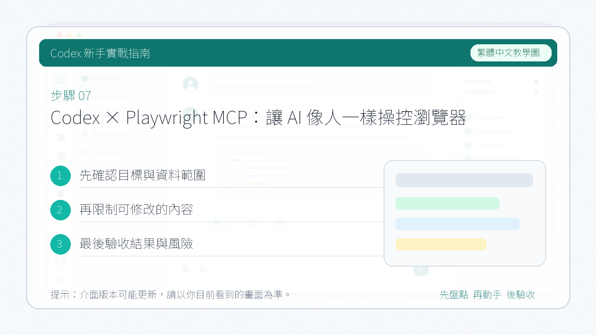

# Codex × Playwright MCP：讓 AI 像人一樣操控瀏覽器

本章節介紹 **Playwright MCP**。這是一個基於 Playwright 的 MCP 伺服器，它把開啟瀏覽器、訪問網頁、點選按鈕、填寫輸入框、讀取頁面內容、截圖、驗證結果等瀏覽器操作，封裝成 AI 可以呼叫的工具。

像 Codex 這類程式設計類的 Agent，不僅能夠編寫和修改程式碼，還能夠開啟網頁，像人一樣檢查頁面是否跑通。

本章節使用**命令列**的方式，來學習 MCP 的安裝和使用。

---

## 1. 安裝

執行以下命令完成安裝：

```bash
codex mcp add playwright npx @playwright/mcp@latest
```


**驗證安裝是否成功：** 進入 Codex，使用 `/mcp` 命令列出當前已經安裝的 MCP 服務列表。


---

## 2. 如何使用

透過 `/mcp` 命令確認安裝成功之後，我們使用 Playwright MCP 來完成一個測試任務：

1. 讓它開啟瀏覽器去搜尋"什麼是 MCP"
2. 找幾篇相關教程
3. 把搜尋結果儲存到 Markdown 本地檔案裡

提示詞：

```
請開啟瀏覽器，到 Google 搜尋「什麼是 MCP」，選擇兩篇優質內容閱讀，並整理成一個 Markdown 檔案儲存在目前目錄。
```


在執行過程中，需要我們放開一些權限，讓它去呼叫相關工具。比如：

- 填寫搜尋框
- 填寫文字
- 開啟網頁

> 這些操作在未授權的情況下，需要**手動放行**。


在執行過程中，你確實會發現它開啟了瀏覽器，並且搜尋了相關內容，還開啟了兩篇文章，這些都是可以看到的。


最終它會把得到的結果總結輸出給我們，然後**寫入到本地的 Markdown 檔案**裡。



Codex 根據搜尋到的兩篇文章的內容進行總結，給我們進行相關的闡述說明。


---

## 參考來源

Playwright MCP 的安裝和使用方式請以官方套件與目前版本說明為準。這裡的搜尋任務只是示範，實際操作時可以改成檢查你的網站、後台或本地開發頁面。
