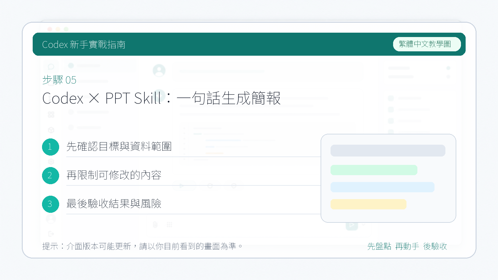

# Codex × PPT Skill：一句話生成簡報

這個案例演示一個對新手很有幫助的流程：如何讓 Codex 協助安裝一個開源 Skill，並在安裝完成後立即呼叫它完成任務。

::: tip 最後核對
官方資料最後核對日期：2026-05-27。本文關於 Skill 機制參考 [Codex Skills](https://developers.openai.com/codex/skills)。案例中使用的 PPT Skill 來自社群倉庫：[guizang-ppt-skill](https://github.com/op7418/guizang-ppt-skill)。第三方 Skill 的安裝方式、依賴要求和輸出格式請以原倉庫說明為準。
:::

## 適用場景

- 你已經找到一個想用的社群 Skill。
- 你想讓 Codex 幫你完成安裝，而不是手動整理目錄和檔案。
- 你希望安裝後立刻用一個真實任務驗證它是否可用。

## 準備一個 Skill 來源

首先要有這個 Skill 的來源地址。很多開發者會把自己做好的 Skill 放在 GitHub 倉庫裡，供其他人安裝和複用。

這個案例裡使用的是一個社群 PPT Skill：

[guizang-ppt-skill](https://github.com/op7418/guizang-ppt-skill)

## 第一步：安裝

你可以把 Skill 倉庫地址交給 Codex，請它協助識別並完成安裝流程。

例如：

```text
請幫我安裝這個 Skill：https://github.com/op7418/guizang-ppt-skill
安裝完成後，告訴我它的用途、依賴要求，以及應該如何呼叫。
```


不同工作區裡，安裝方式可能不完全一樣。有些會直接支援安裝，有些則會先分析倉庫結構，再提示你確認放置位置或依賴要求。

## 第二步：呼叫使用

安裝完成後，可以直接讓 Codex 呼叫這個 Skill 去完成一項真實任務。

如果這個 Skill 已經提前安裝過，你通常也可以透過斜槓命令、技能選擇器，或者在任務裡明確點名的方式來呼叫它。


例如：

```text
請使用剛剛安裝的 PPT Skill，根據“AI 程式設計工具入門”這個主題生成一份適合分享的演示稿。先告訴我還缺哪些關鍵資訊。
```

如果你沒有給足上下文，Codex 往往會先回到這個 Skill 的操作手冊裡，看看它需要什麼輸入，然後再向你追問必要資訊。


當你補齊背景、主題、受眾或風格要求後，它會按該 Skill 的流程去讀取 README、模板和相關文件，再生成結果。


如果這個 Skill 的預設產物是 HTML 演示稿，你通常可以直接在 Codex 內建瀏覽器裡開啟預覽。



## 你要重點檢查什麼

- Codex 安裝的是不是你指定的那個 Skill，而不是名稱相似的別的倉庫。
- 安裝後有沒有說明依賴要求、輸出格式和呼叫方式。
- 生成結果是否符合這個 Skill 原倉庫描述的能力邊界。
- 如果結果不理想，是 Skill 本身限制，還是你提供的輸入資訊不夠。

## 風險提醒

- 社群 Skill 不是官方能力，品質和維護狀態差異會很大，使用前最好先看倉庫 README。
- 不要預設“給出 GitHub 連結就一定能一步安裝成功”，有些 Skill 還會依賴額外指令碼、模板或本地環境。
- 第一次驗證時，優先選一個小任務，確認 Skill 能正常執行後，再拿去做正式產物。
