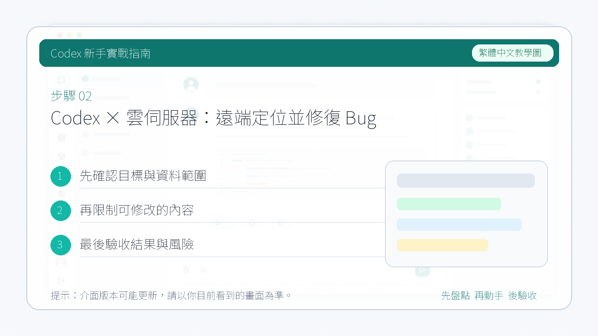

# Codex × 雲伺服器：遠端定位並修復 Bug

> 你的程式碼跑在雲伺服器上，本地一行程式碼都沒有——Codex 照樣能幫你找到 Bug、修好它、跑通測試。這篇文章手把手帶你走一遍完整流程。

---

## 一、背景：Codex 的遠端模式是什麼？

我們平時用 Codex CLI，預設都是在本地專案裡跑。你的程式碼在 Mac 上，Codex 就在 Mac 上幫你改。

但現實中有一種很常見的場景：**程式碼不在你電腦上，在遠端伺服器裡。**

比如：

- 專案部署在雲伺服器的 Docker 容器裡
- 你只有 SSH 權限，本地沒有原始碼
- 線上環境出了 Bug，需要直接在遠端定位和修復

Codex 的 **遠端模式（Remote Mode）** 就是幹這個的——你在本地敲命令，Codex 在遠端伺服器上讀程式碼、改程式碼、跑測試，整個過程你的 Mac 上不需要克隆任何倉庫。

架構很簡單：

```
┌──────────────────┐         SSH 隧道         ┌──────────────────────────┐
│  你的 Mac 本地    │  ◀───────────────────▶   │  遠端伺服器（雲主機）       │
│  codex --remote  │       埠轉發 9001       │  codex app-server        │
│  （TUI 介面）     │                          │  （程式碼 + 執行環境）       │
└──────────────────┘                          └──────────────────────────┘
```

本地只負責"表達需求、審查結果"，遠端負責"程式碼、依賴、執行"。AI 在兩者之間執行可驗證的步驟。

---

## 二、實戰場景：容器裡的 Python 指令碼報錯了

### 專案介紹

我在 Google Cloud / AWS / Azure 這類雲端主機上有一個 Docker 容器 `codex-demo`，裡面有一個小專案 `docker-health-demo`，用來生成容器健康檢查報告。

專案結構：

```
/workspace/docker-health-demo/
├── containers.json           # 模擬的容器狀態資料
├── container_health.py       # 健康檢查指令碼（有 Bug）
└── test_container_health.py  # pytest 測試檔案
```

### 問題復現

直接執行指令碼：

```bash
python3 container_health.py
```

💥 報錯：

```
KeyError: 'status'
```


跑測試也一樣掛：

```bash
pytest -q
```

```
FAILED - KeyError: 'status'
```

問題很明顯：程式碼裡讀了一個叫 `status` 的欄位，但資料檔案裡這個欄位叫 `state`。一個欄位名寫錯了。

對人來說這是 30 秒的事；這篇文章的重點是**演示 Codex 如何遠端完成整個流程**。

---

## 三、完整操作步驟

### 第 1 步：在遠端伺服器上啟動 app-server

SSH 登入你的雲伺服器，進入容器，在專案目錄下啟動 Codex 的 app-server：

```bash
ssh root@你的伺服器IP
docker exec -it codex-demo bash
cd /workspace/docker-health-demo
codex app-server --listen ws://0.0.0.0:9001
```

看到類似這樣的輸出就說明啟動成功了：

```
codex app-server (WebSockets)
  listening on: ws://0.0.0.0:9001
  readyz: http://0.0.0.0:9001/readyz
  healthz: http://0.0.0.0:9001/healthz
```



> ⚠️ 注意：不要加 `--ws-auth` 引數。透過 SSH 隧道連線時，安全性由 SSH 本身保證，不需要額外的 WebSocket 認證。

### 第 2 步：本地建立 SSH 埠轉發

在 Mac 上**新開一個終端視窗**，建立 SSH 隧道把遠端的 9001 埠對映到本地：

```bash
ssh -N -L 9001:127.0.0.1:9001 root@你的伺服器IP
```

輸入密碼後沒有任何輸出是正常的——它就是一條安靜的隧道，掛著就行。

可以驗證一下隧道是否通暢：

```bash
curl -i http://127.0.0.1:9001/healthz
```

返回 `HTTP/1.1 200 OK` 就說明隧道沒問題。


### 第 3 步：本地登入 Codex（僅首次需要）

如果你從來沒在本地登入過 Codex CLI，需要先完成一次登入：

```bash
codex auth login
```

它會在瀏覽器開啟 OpenAI 的登入頁面，登入你的 ChatGPT 帳號即可。登入成功後終端會顯示 `Successfully logged in`。

> 💡 這一步只需要做一次，之後登入憑證會快取在本地。

### 第 4 步：連線遠端專案

**再開一個終端視窗**，輸入：

```bash
codex --remote ws://127.0.0.1:9001
```

如果一切順利，你會看到 Codex 的 TUI 介面，**目錄顯示的是遠端容器裡的路徑**：

```
>_ OpenAI Codex (v0.130.0)

model:     gpt-5.5   /model to change
directory: /workspace/docker-health-demo
```


到這裡，遠端連線就成功了。你本地的 Codex 已經"站在"遠端伺服器的專案目錄裡了。

### 第 5 步：讓 Codex 修復 Bug

在 Codex 的輸入框裡輸入提示詞：

```
find and fix the bug in container_health.py, then run pytest to verify
```


Codex 會自動完成以下步驟：

1. 讀取 `container_health.py` 和 `containers.json`
2. 發現欄位名不匹配：程式碼裡用了 `"status"`，資料裡是 `"state"`
3. 修改程式碼
4. 執行 `pytest -q` 驗證修復結果

修復完成後的輸出：

```bash
python3 container_health.py
```

```
container_health_report
total=5
running=3
exited=2
unhealthy=redis-cache,old-api
```

```bash
pytest -q
```

```
1 passed in 0.00s
```


Done。一個遠端 Bug 修復的完整閉環。

---

## 五、總結

Codex 遠端模式的核心價值：**你不需要把程式碼拉到本地，就能讓 AI 直接在遠端環境裡幫你定位和修復問題。**

整個流程拆開來看就三件事：

1. 遠端啟動 `codex app-server`
2. 本地 SSH 隧道轉發埠
3. 本地 `codex --remote` 接入

一旦連通，體驗和本地使用 Codex 完全一致——讀檔案、改程式碼、跑測試，全部在遠端執行。

這對於以下場景特別有用：

- 線上服務出 Bug，需要快速定位
- 開發環境在遠端 GPU 伺服器上
- 多人協作時需要直接在共享伺服器上改程式碼
- 本地機器效能不夠，依賴裝不全

遠端模式目前還是 Alpha 階段，體驗上還有一些粗糙的地方（比如 WebSocket 連線偶爾會降級為 HTTPS），但核心功能已經可用。未來隨著 Codex 的迭代，這個能力只會越來越穩。
